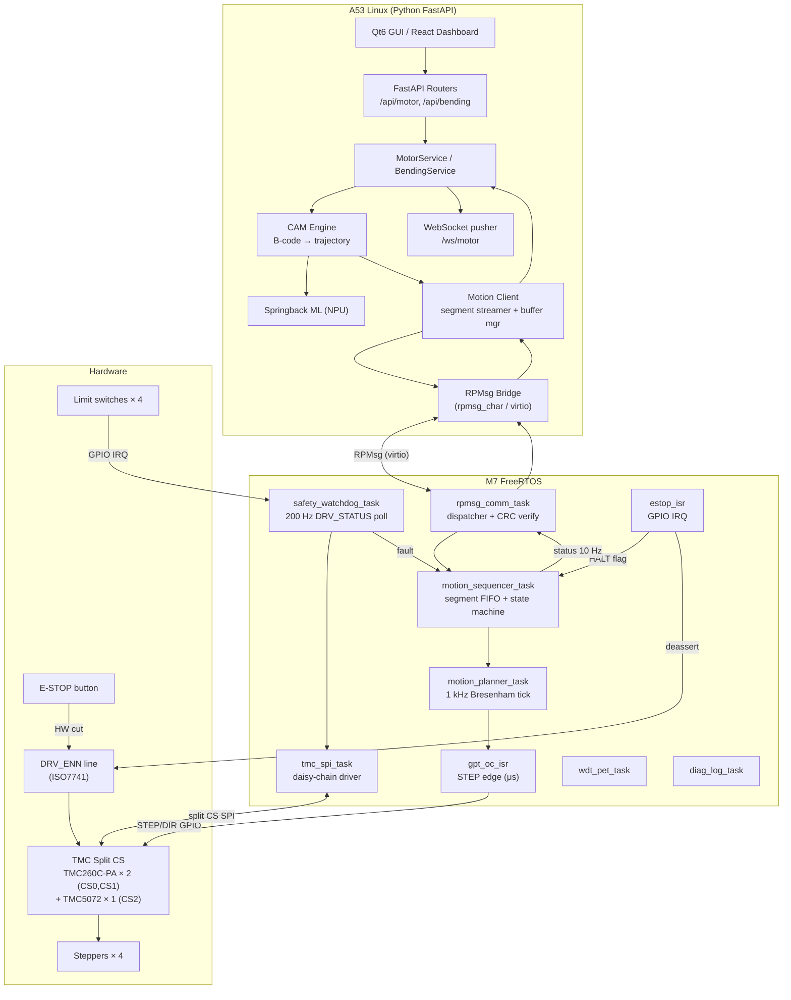
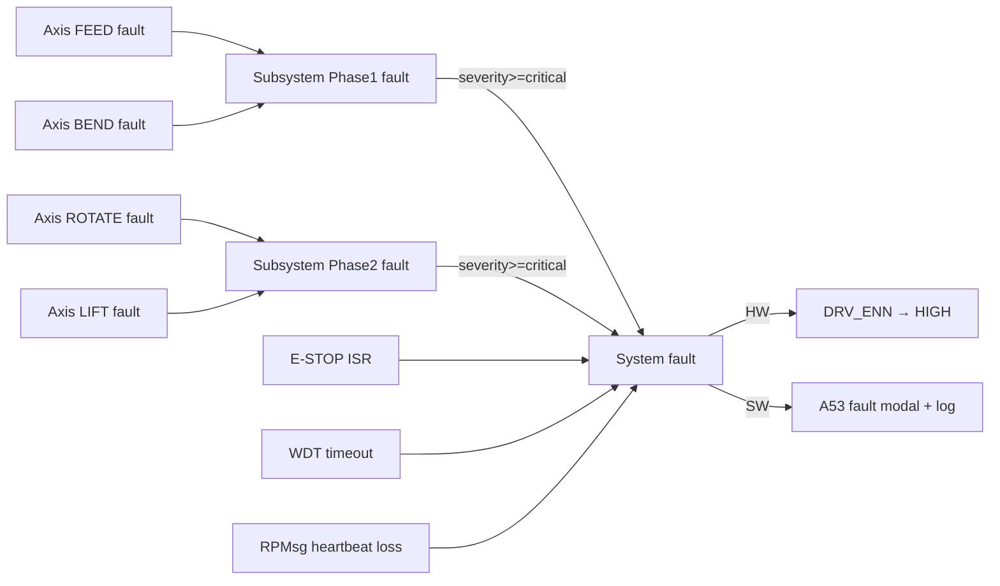
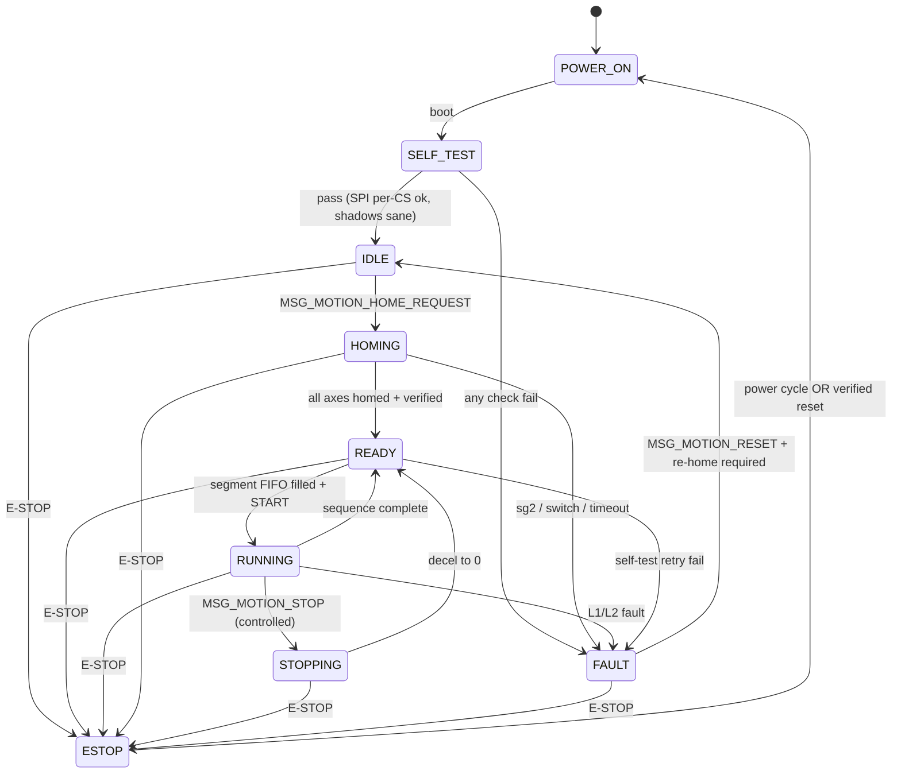
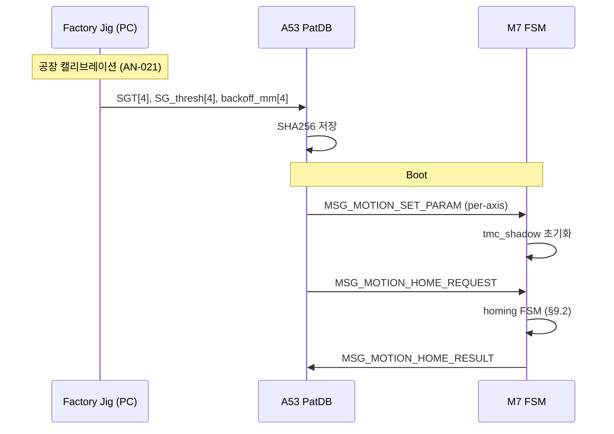
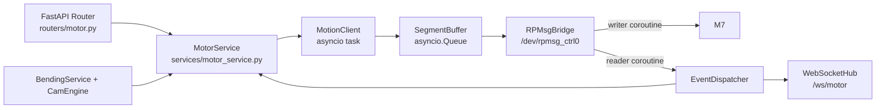

# 모터 제어 SW 아키텍처 설계 — Ortho-Bender 4축 와이어 벤딩 머신

**문서 ID**: `docs/architecture/motor-control-architecture.md`
**상태**: 설계 초안 (결재 Gate 대기)
**작성자**: architect
**작성일**: 2026-04-12
**기반 문서**: `docs/research/motor-control-benchmarking.md`
**규제**: IEC 62304 SW Class B, FDA 21 CFR 820 Design Controls, ISO 14971

---

## 1. Scope & Design Inputs

### 1.1 범위
본 문서는 Ortho-Bender 제품의 **4축 스텝퍼 기반 모션 제어 소프트웨어 계층**(A53 Python ↔ RPMsg ↔ M7 FreeRTOS ↔ TMC SPI split CS ↔ HW DRV_ENN/E-STOP)의 아키텍처를 정의한다. 전기적 인터페이스 상세(핀맵, 전원, 절연)는 HW 스펙(`.claude/memory/project_m7_pin_map.md`) 및 회로 설계 산출물에 의존한다.

### 1.2 설계 입력 (Design Inputs — FDA 21 CFR 820.30(c))

| # | 항목 | 출처 | 반영 위치 |
|---|-----|-----|---------|
| DI-1 | E-STOP 응답 < 1 ms (HW path < 100 ns) | `.claude/rules/project-rules.md` | §7, §8 |
| DI-2 | IEC 62304 Class B (motion은 Class C 가능성) | project-rules.md | 전 섹션 |
| DI-3 | A53 ↔ M7 RPMsg 단일 채널 | `src/shared/ipc_protocol.h` | §5, §6 |
| DI-4 | TMC260C-PA × 2 (CS0,CS1) + TMC5072 (CS2), ECSPI2 split CS, M7 exclusive | project_hardware_decisions.md | §4 |
| DI-5 | Klipper 100 ms pre-buffer, M7 GPT OC ISR, 1 ms planner tick | motor-control-benchmarking.md §4.1–§4.3 | §3, §4 |
| DI-6 | StallGuard2 primary + 기계 limit switch redundancy | benchmarking §4.5 | §9 |
| DI-7 | FastAPI envelope `{success,data,error,metadata}` 유지 | `src/app/server/routers/motor.py` | §3 |
| DI-8 | 기존 `ipc_protocol.h` v2 역방향 호환 | `ipc_protocol.h` | §6 |
| DI-9 | M7 동적 할당 금지, WDT 200 ms | project-rules.md | §4, §7 |

### 1.3 비목표
- FOC / closed-loop encoder 제어 (스텝퍼 open-loop + StallGuard2 가정).
- A53 측 NPU 스프링백 모델 학습 파이프라인 (별도 문서).
- 전기적 레벨시프터/절연 회로 (HW 설계 문서 범위).

---

## 2. Architectural Drivers (품질 속성)

| ID | Attribute | Scenario | Metric | Design Tactic |
|----|-----------|----------|--------|---------------|
| QA-1 | Safety | E-STOP 버튼 | HW cutoff <100 ns, SW ISR <500 μs | Dual path (§7) |
| QA-2 | Real-time determinism | 최대 속도 시 step jitter | < 2 μs @ 25 kHz step rate | M7 GPT OC, NVIC 최고 우선순위 |
| QA-3 | Host jitter tolerance | A53 Linux GC/IRQ 스파이크 | < 100 ms 흡수 | 100 ms pre-buffer |
| QA-4 | Fault isolation | 한 축 과온 | 타 축 영향 없이 축만 disarm | 3-layer fault model (§7) |
| QA-5 | Traceability | 규제 로그 | 모든 fault에 `reason_code` + `timestamp_us` | `msg_status_alarm_t` + logger |
| QA-6 | Testability | 하드웨어 없는 dev | Mock backend로 전 플로우 구동 | `MotorService` mock mode (기존 자산) |
| QA-7 | Backward compat | 기존 FastAPI 클라이언트 | 현재 `/api/motor/*` 깨지지 않음 | §6.4 버저닝 전략 |

---

## 3. System Layer View



**Trust boundary**: A53 Linux (untrusted realtime) / M7 FreeRTOS (trusted realtime). 모든 모션 승인 결정은 M7이 최종 수행 — A53 은 "요청자", M7은 "실행 및 거부권자".

---

## 4. M7 FreeRTOS Task Structure

### 4.1 Task Table

| Task | 주기 | 우선순위 (FreeRTOS) | 스택 (words) | 책임 | Blocking 허용? | 근거 |
|------|-----|---------------------|-------------|-----|---------------|------|
| `gpt_oc_isr` (ISR) | event-driven (μs) | NVIC 최고 (0) | ISR stack | STEP edge toggle, min-width timer reload | 금지 (no FreeRTOS API except `FromISR`) | benchmarking §4.3 |
| `estop_isr` (ISR) | event-driven | NVIC 최고 (0) | ISR stack | HALT 플래그 set + semaphore give | 금지 | §7 |
| `motion_planner_task` | 1 ms (tick) | `configMAX_PRIORITIES-1` | 1024 | Bresenham + trapezoid, `(interval,count,add)` FIFO → GPT OC reload | 금지 (deadline-critical) | Marlin pulse_phase_isr, Klipper queue_step |
| `motion_sequencer_task` | event + 10 ms | `configMAX_PRIORITIES-2` | 1024 | 상위 상태머신 (§8), segment FIFO, homing FSM, WDT pet | queue wait 허용 | `motion_task.c` |
| `safety_watchdog_task` | 5 ms (200 Hz) | `configMAX_PRIORITIES-2` | 768 | DRV_STATUS 전체 체인 SPI 폴링, fault latch, heartbeat ACK | SPI wait 허용 | AN-002, §9 |
| `rpmsg_comm_task` | event-driven | `configMAX_PRIORITIES-3` | 2048 | RPMsg RX/TX, CRC 검증, msg dispatch, 10 Hz 상태 TX | virtio wait 허용 | `src/firmware/source/ipc/ipc_task.c` |
| `tmc_spi_task` | gated (mutex) | `configMAX_PRIORITIES-3` | 512 | SPI transaction serializer, per-CS clock speed, GPIO CS toggle (CS1/CS2), response parser | SPI wait 허용 | §5 |
| `diag_log_task` | 100 ms | `tskIDLE_PRIORITY+1` | 768 | trace 링버퍼 flush, A53로 비동기 로그 push | 허용 | §10 |
| `wdt_pet_task` | 50 ms | `tskIDLE_PRIORITY+2` | 256 | HW WDT kick (조건: 모든 critical task `alive=true`) | 금지 | `.claude/rules/coding-rules.md` |

**설계 원칙**:
- `motion_planner_task`는 절대 `SPI wait` 금지 — SPI는 항상 `tmc_spi_task`를 통해서만 접근. Planner가 register read가 필요하면 cached copy 참조.
- `wdt_pet_task`는 모든 watchdog-critical task가 heartbeat flag를 set한 경우에만 HW WDT를 kick. 한 task가 죽으면 WDT 만료로 reset (§7.3).
- 스택 크기는 `uxTaskGetStackHighWaterMark` 검사 + 25% 마진 적용. `FreeRTOSConfig.h`에서 stack overflow detection (method 2) 활성.

### 4.2 Memory Budget (static only)

| 영역 | 크기 | 비고 |
|-----|-----|-----|
| FreeRTOS heap | 0 | 동적 할당 전면 금지 |
| Task stacks 합계 | ≈ 7 KB | 위 표 합 |
| Segment FIFO | 128 × 32 B = 4 KB | 100 ms pre-buffer @ 1 ms tick |
| Step pattern ring buffer | 2 KB | per-axis |
| TMC shadow registers | 3 CS × 128 B = 384 B | ghost copies for readback cache (CS0: TMC260C FEED, CS1: TMC260C BEND, CS2: TMC5072) |
| Log ring | 4 KB | `diag_log_task` |
| **총** | **< 18 KB** | TCM 가용량 내 여유 |

### 4.3 Timing Budget

| 경로 | 예산 | 근거 |
|-----|-----|-----|
| Step ISR max | 10 μs | 25 kHz 최대 step rate |
| Planner tick WCET | 300 μs | 1 ms 주기의 30% |
| Safety poll WCET | 2 ms | 5 ms 주기의 40% |
| RPMsg RX dispatch | 500 μs | heartbeat 100 ms budget 대비 여유 |
| E-STOP ISR → DIS | < 500 μs | QA-1 |

---

## 5. SPI Protocol Detail (Split CS Topology)

### 5.1 Topology
- **ECSPI2**, M7 exclusive, **3 independent chip-selects** (split CS, NOT daisy-chain).
- CS0: hardware `ECSPI2_SS0` → DRI0035 #1 (TMC260C-PA, FEED axis)
- CS1: GPIO3_IO19 (software CS) → DRI0035 #2 (TMC260C-PA, BEND axis)
- CS2: GPIO3_IO20 (software CS) → TMC5072-BOB (ROTATE + LIFT, 2 motors)
- Level shifter: TXS0108E (1.8V ↔ 5V), shared MOSI/MISO/SCK lines with per-CS routing.
- Galvanic isolation: ISO7741 × 2 on DRI0035 motor-side.

### 5.2 Datagram & Frame Layout

Each driver is addressed independently via its chip-select. No daisy-chain framing.

**TMC260C-PA (CS0, CS1):**
- 20-bit datagram: `TAG(4) + DATA(16)`, MSB-first, SPI Mode 3, max 2 MHz.
- Transferred as 3 bytes (24 clock cycles, upper 4 bits ignored on read).
- Register tags: DRVCTRL=0x00, CHOPCONF=0x04, SMARTEN=0x05, SGCSCONF=0x06, DRVCONF=0x07.
- Response: `SG_RESULT(10) + reserved(2) + status(8)` = 20 bits in 3 bytes.

**TMC5072-BOB (CS2):**
- 40-bit datagram: `RW(1) + ADDR(7) + DATA(32)`, MSB-first, SPI Mode 3, max 4 MHz.
- Transferred as 5 bytes (40 clock cycles).
- Supports 2 motors (M0=ROTATE, M1=LIFT) via register address offset.
- Response: `SPI_STATUS(8) + DATA(32)` = 40 bits in 5 bytes.

**Advantage over daisy-chain:** each driver can be addressed independently, different clock speeds per CS are possible, and a fault on one CS does not affect others.

### 5.3 Per-Driver Transaction
Since each driver has its own CS, there is no chain byte-ordering concern. Each SPI transaction addresses exactly one driver:

| Target | CS | Bytes | Clock |
|--------|-----|-------|-------|
| TMC260C FEED | CS0 (HW SS0) | 3 | 2 MHz |
| TMC260C BEND | CS1 (GPIO) | 3 | 2 MHz |
| TMC5072 ROTATE/LIFT | CS2 (GPIO) | 5 | 4 MHz |

`tmc_spi_task` asserts the appropriate CS, transfers the datagram, then deasserts. For GPIO-based CS (CS1, CS2), the task manually toggles the GPIO pin around the ECSPI transfer.

### 5.4 Read Latency

**TMC260C (CS0, CS1):** Response is immediate — the 20-bit response arrives in the same transaction as the write. No latency.

**TMC5072 (CS2):** Read uses **2-pass** method (AN-002 "latched response"):
- Transfer 1: send read request `RW=0 + ADDR` → response contains previous transaction's data.
- Transfer 2: send dummy (e.g., `GCONF read`) → response contains the requested register data.
- `tmc_spi_task` API hides this: `tmc5072_read(addr, &val)` performs both transfers internally.

### 5.5 Clock Speed

| Driver | Max SCK | Recommended | Notes |
|--------|---------|-------------|-------|
| TMC260C-PA | 2 MHz | 2 MHz | Legacy, VCC_IO limited |
| TMC5072 | 8 MHz | 4 MHz | Conservative for signal integrity through TXS0108E |

**Split CS advantage:** each CS can run at its optimal clock speed. TMC260C transactions at 2 MHz, TMC5072 at 4 MHz. No lowest-common-denominator constraint.

### 5.6 Concurrency & Atomicity
- SPI 접근은 **`tmc_spi_task`가 소유**. 타 task는 queue에 request 를 post하고 결과 semaphore 대기.
- `motion_planner_task`는 SPI를 절대 호출하지 않음. Readback 값이 필요하면 shadow register (5.7) 참조.
- `safety_watchdog_task`는 SPI queue 에 최고 우선순위로 포스팅 (priority inversion 방지 위해 mutex가 아닌 priority queue).
- Critical section: per-driver 트랜잭션 진행 중 `taskENTER_CRITICAL`은 **사용 금지**. 대신 SPI DMA 완료 IRQ 사용 또는 busy-polling `tmc_spi_task` 내부에서만. TMC260C 트랜잭션 = 12 μs (3 bytes @ 2 MHz), TMC5072 트랜잭션 = 10 μs (5 bytes @ 4 MHz).

### 5.7 Shadow Register Cache
- `tmc_spi_task`는 per-driver 폴링 결과를 per-driver `tmc_shadow_t[3]` 에 ghost copy (CS0: TMC260C FEED, CS1: TMC260C BEND, CS2: TMC5072).
- Planner/sequencer는 `tmc_shadow_get(axis, REG)` 로 lock-free read (각 필드 `volatile uint32_t`).
- 쓰기는 항상 SPI 경유.

### 5.8 Error Detection (CRC 대체)
TMC SPI는 자체 CRC 없음. 대안:
1. **SPI_STATUS byte sanity check**: 각 드라이버 응답의 `SPI_STATUS[7:0]` 에 항상 `reset_flag`, `driver_error`, `sg2`, `standstill` 비트가 나온다. `0x00` or `0xFF` 연속 → SPI bus fault 의심.
2. **Round-trip write-read 검증**: 초기화 시 non-critical 레지스터에 known pattern write → 다음 전송에서 readback 일치 확인.
3. **Heartbeat register**: `safety_watchdog_task` 가 각 드라이버의 `IFCNT` 혹은 `GSTAT` 을 주기적으로 read. 값이 변하지 않으면 fault.
4. 3회 연속 실패 → Layer 3 fault (system disarm). Split CS 구조상 특정 CS 단독 fault 가능 → CS별 fault counter 관리.

---

## 6. IPC (RPMsg) Message Schema

### 6.1 기존 자산 스냅샷 (`src/shared/ipc_protocol.h`)

핵심 확인 사항:
- `IPC_PROTOCOL_VERSION = 2U`
- `ipc_msg_header_t` = 24 byte, CRC-32 포함.
- 이미 존재하는 motion 메시지: `MSG_MOTION_EXECUTE_BCODE`, `JOG`, `HOME`, `STOP`, `ESTOP`, `SET_PARAM`, `RESET`, `WIRE_DETECT`, `SET_DRV_ENABLE` (0x0100-0x0108).
- 상태: `MSG_STATUS_MOTION` (0x0300), `MSG_STATUS_TMC`, `MSG_STATUS_ALARM`, `MSG_STATUS_BCODE_COMPLETE`, `MSG_STATUS_HEARTBEAT`, `MSG_STATUS_HOMING_DONE` 등.

### 6.2 Gap 분석
Klipper-style pre-buffer 실행 모델은 `EXECUTE_BCODE`의 **단일 payload 128 step** 모델만으로는 부족:
- 길이가 긴 시퀀스는 스트리밍 필요.
- Planner가 결정한 **trajectory segment** (가속/순항/감속 구간) 단위 전송이 효율적.
- Underrun 대응을 위한 fill-level feedback 필요.

### 6.3 신규 메시지 제안 (v3, 역방향 호환 유지)

| 신규 타입 | 코드 | 방향 | 목적 | 중요 필드 |
|---------|------|-----|-----|----------|
| `MSG_MOTION_PLAN_SEGMENT` | `0x0110` | A53 → M7 | Trajectory segment 스트림 | `seg_id(u32)`, `axis_mask(u8)`, `steps_count(u32)`, `initial_rate(u32)`, `final_rate(u32)`, `accel(i32)`, `dir_bits(u8)` |
| `MSG_MOTION_SEGMENT_ACK` | `0x0311` | M7 → A53 | 수신/저장 결과 + fill level | `seg_id`, `fifo_used`, `fifo_capacity`, `result(enum)` |
| `MSG_MOTION_BUFFER_UNDERRUN` | `0x0312` | M7 → A53 | Planner FIFO 고갈 임박 (<20 ms) | `fifo_ms_remaining` |
| `MSG_MOTION_STATUS_REPORT` | `0x0313` | M7 → A53 | 10 Hz broadcast (motion + tmc + fifo 통합) | `motion`, `tmc_summary`, `fifo_ms` |
| `MSG_MOTION_FAULT` | `0x0314` | M7 → A53 | 비동기 fault (ALARM의 확장) | `layer(u8)`, `axis`, `reason_code(u32)`, `snapshot[32B]` |
| `MSG_MOTION_HOME_REQUEST` | `0x0115` | A53 → M7 | 이중화 homing (기존 0x0102 대체 아닌 보완) | `axis_mask`, `sg_threshold[4]`, `mode(enum: sg_only/switch_only/both)` |
| `MSG_MOTION_HOME_RESULT` | `0x0315` | M7 → A53 | per-axis 결과 | `axis_mask`, `status[4]`, `position[4]`, `sg_seen[4]` |

**코드 공간 확보**: 0x0110–0x011F 범위는 현재 `ipc_msg_type_valid()`의 `0x0100 ≤ type ≤ 0x0107` 범위를 벗어난다. → `ipc_msg_type_valid` **확장 필요** 하지만 기존 값들은 보존.

### 6.4 역방향 호환성 전략

| 요소 | 기존 | 신규 | 호환 전략 |
|-----|-----|-----|---------|
| `IPC_PROTOCOL_VERSION` | 2 | 3 | A53 → M7 handshake에서 버전 negotiate; M7이 v2만 지원하면 v2 fallback 경로 사용 |
| 기존 타입 0x0100–0x0108 | 유지 | 유지 | 필드 추가/삭제 금지 |
| 신규 타입 0x0110+ | — | 신규 | `ipc_msg_type_valid()` 업데이트 |
| `ipc_msg_header_t` | 24B | 24B | **변경 금지** — CRC, magic, timestamp 모두 불변 |
| FastAPI `/api/motor/*` | 유지 | 유지 | `MotorService`가 신규 segment API를 내부적으로 사용. 엔드포인트 시그니처 불변 |

### 6.5 Segment Frame Size 분석
제안 payload:
```
msg_motion_plan_segment_t {
  uint32_t seg_id;
  uint8_t  axis_mask;
  uint8_t  dir_bits;
  uint8_t  flags;         /* bit0: last_of_move, bit1: sync_point */
  uint8_t  _pad;
  uint32_t steps_count;
  uint32_t initial_rate;  /* step/s fixed-point Q16.16 */
  uint32_t final_rate;
  int32_t  accel;         /* step/s^2 */
  uint32_t duration_us;
} // 32 bytes
```
- 32 B payload + 24 B header = **56 B / segment**.
- 1 ms tick × 128 slots FIFO = 128 ms pre-buffer > 100 ms 요구치.
- A53 → M7 bandwidth: 평균 1 segment/10 ms = 5.6 KB/s, burst 시 56 KB/s — RPMsg 충분.
- `IPC_MAX_PAYLOAD_SIZE = 1600U` 여유 충분, 배치 전송도 가능 (최대 50 segment/msg).

### 6.6 Heartbeat & Watchdog
- `MSG_STATUS_HEARTBEAT` 주기 100 ms (M7 → A53).
- A53가 250 ms heartbeat 미수신 → `/api/motor/status` 에러 + UI 경고.
- M7가 500 ms 내 A53 command/ACK 미수신 → `motion_sequencer_task` 자동 controlled decel + HOLD.
- 1 s 미수신 → Layer 3 fault + DRV_ENN drop.

---

## 7. Safety Architecture (3-Layer Hierarchical)

### 7.1 계층 정의

| Layer | 스코프 | 트리거 | 1차 대응 | 복구 |
|-------|-------|-------|---------|-----|
| **L1 — Axis** | 단일 축 | DRV_STATUS `ot`/`s2g`/`ola`, step 소실, 축 soft limit | 해당 축 velocity → 0 (controlled), axis FSM → FAULT | clear_errors + re-home axis |
| **L2 — Subsystem** | Phase1 (FEED+BEND) 또는 Phase2 (ROTATE+LIFT) | L1 fault 전파, inter-axis interlock 위반, SPI bus fault | Subsystem 소속 모든 축 감속 후 FAULT, 타 subsystem은 계속 가능 여부 평가 | 명시적 subsystem reset + homing |
| **L3 — System** | 전체 장비 | E-STOP, RPMsg timeout, WDT, CRC 반복 실패 | **DRV_ENN HIGH** (HW cut) + 모든 FSM → ESTOP | 사용자 ack + 전원 cycle or verified reset, **항상 re-home 강제** |

### 7.2 Fault Propagation Rules



**엘리베이션 규칙**:
- L1 → L2: 동일 subsystem에서 L1 fault 발생 즉시.
- L2 → L3: severity = CRITICAL (s2g, overtemp shutdown, stack overflow, WDT) 또는 L1 fault가 양 subsystem에서 동시 발생.
- 본드 벤딩 중 L1 BEND fault 발생 시 FEED는 "축 hold"로만 가능(L2P1). 와이어가 여전히 BEND die에 물려있을 수 있으므로 자동 복귀 금지.

### 7.3 Dual-path E-STOP

| Path | 경로 | 예산 | 구현 |
|------|-----|-----|-----|
| **HW** | E-STOP button → 래치 릴레이 → DRV_ENN HIGH (ISO7741 통과) | < 100 ns | 하드와이어 |
| **SW** | E-STOP GPIO → M7 EXTI ISR → `estop_flag=1` + `xSemaphoreGiveFromISR` → `motion_sequencer_task` → HALT + STEP pin 즉시 LOW + deceleration command → fault broadcast | < 500 μs | `src/firmware/source/safety/estop.c` 확장 |
| **WDT** | `wdt_pet_task` 미 kick → HW WDT reset → boot ROM이 GPIO 기본상태로 초기화, 이때 DRV_ENN 기본 HIGH (풀업) | < 200 ms | HAL + bootloader |

**중요**: SW path와 HW path는 **논리 OR**. SW 실패해도 HW가 drive 차단. SW가 먼저 성공해도 controlled decel 은 SW path가 담당하므로 기계적 손상 감소.

### 7.4 IEC 62304 Class B/C Justification 포인트

| 요구 | 근거 문서 | 본 설계 대응 |
|-----|---------|----------|
| Software safety classification | ISO 14971 hazard → 62304 §4.3 | Motion 계층은 Class B (잠재적 경상해), dual-path E-STOP 은 하드웨어 safety control로 분류되어 SW 실패가 환자 손상으로 직결되지 않음 → Class B 유지 가능 |
| Segregation of safety items | 62304 §5.3.5 | M7 firmware는 A53과 분리된 core + 독립 메모리 공간, ECSPI2 exclusive ownership |
| Risk control measures | 62304 §7.4 | 3-layer fault model = Control measure; HW DRV_ENN = Protective measure; 사용 설명서(IFU) = Information for safety |
| Traceability | 62304 §5.1.1 | 모든 `reason_code` → SRS 요구사항 → risk register 항목 연결 (별도 매트릭스) |
| Problem resolution | 62304 §6 | `MSG_MOTION_FAULT` snapshot + `diag_log_task` 링버퍼 + A53 영속화 |
| FDA Design Controls | 21 CFR 820.30 | DI 표(§1.2) = Design Inputs, 본 문서 = Design Outputs, V&V는 Phase 9/10 |

### 7.5 Response Time Budget

| 요구 | 한도 | 설계 예산 | 마진 |
|-----|-----|---------|-----|
| HW E-STOP → 출력 차단 | 1 ms | 100 ns | 10000× |
| SW E-STOP → 감속 개시 | 1 ms | 500 μs | 2× |
| L1 fault → axis halt | 10 ms | 5 ms (polling 주기 상한) | 2× |
| L2 fault → subsystem halt | 20 ms | 10 ms | 2× |
| Buffer underrun → controlled stop | 100 ms | 50 ms | 2× |
| RPMsg heartbeat loss → HOLD | 500 ms | 250 ms | 2× |

---

## 8. State Machine

### 8.1 System-Level FSM



### 8.2 전이 규칙 (일부)

| 전이 | 트리거 | 선결 조건 | Side effect | 이동 중 축 허용? |
|-----|-------|--------|----------|--------------|
| IDLE → HOMING | MSG_MOTION_HOME_REQUEST | DRV_ENN LOW | axis FSM → HOMING, TCOOLTHRS 적용 | 해당 axis만 |
| READY → RUNNING | segment FIFO ≥ 50 ms 채워짐 + 사용자 START | 모든 축 homed, fault 없음 | planner tick enable | subsystem 내 다중 축 OK |
| * → FAULT | alarm queue 비어있지 않음 | — | controlled decel, A53 broadcast, 축 disarm | 없음 |
| FAULT → IDLE | `MSG_MOTION_RESET` + user ack | 모든 active alarm cleared, DRV_STATUS clean | 축 FSM reset, **re-homing 요구 플래그 set** | 없음 |
| * → ESTOP | E-STOP ISR | — | DRV_ENN HIGH, step output LOW, all FSM → ESTOP | 절대 없음 |
| ESTOP → POWER_ON | verified reset 또는 power cycle | E-STOP 버튼 릴리즈 + 사용자 ack | 모든 상태 초기화, re-homing 강제 | 없음 |

### 8.3 Axis sub-FSM (per-axis)
```
DISARMED → ARMED → MOVING → ARMED → DISARMED
                       ↓
                     FAULT → (system reset)
```
- `DISARMED`: DRV_ENN HIGH or subsystem off
- `ARMED`: 홀드 전류만, velocity 0
- `MOVING`: planner가 step 방출 중

---

## 9. Homing Algorithm

### 9.1 2단계 이중화
1. **Primary — StallGuard2 sensorless**: 공장 캘리브레이션에서 저장한 per-axis `SGT`, `TCOOLTHRS`, expected `SG_RESULT` 상한 사용. chopper = `spreadCycle` 강제, `SEMIN = 0`.
2. **Secondary — Limit switch**: FEED/BEND는 기계 over-travel end switch (M7 GPIO IRQ), ROTATE/LIFT는 광학 index 또는 SW soft limit.

### 9.2 Sequence
1. `motion_sequencer_task`가 `HOMING` 상태 진입 → TMC 레지스터를 homing profile로 switch (별도 shadow set).
2. 축별 slow approach (목표 속도의 20%) 시작 → SG_RESULT 모니터링.
3. DIAG 핀 IRQ 또는 SG_RESULT < threshold 감지 → 위치 latch.
4. **Backoff** (reverse 1 mm 등) → **fine approach** (slow approach의 10%).
5. 2-pass 결과 차이 > 1 full step → homing fault. Limit switch가 먼저 트리거되면 과도 진행 → 즉시 FAULT, 사용자 개입 요구.
6. 성공 → `MSG_MOTION_HOME_RESULT`, `motion_sequencer_task` → READY.

### 9.3 Calibration Data Flow



### 9.4 Failure Modes & Recovery
| 실패 | 원인 | 대응 |
|-----|-----|-----|
| Limit switch가 SG2보다 먼저 트리거 | 캘리브레이션 드리프트 | FAULT + 사용자 수동 재캘리브레이션 |
| SG_RESULT 과민 (false positive) | 마찰 변화 | 3회 재시도 → 실패 시 FAULT |
| 양 pass 불일치 | 기계 유격 | 1회 재시도 후 실패 시 FAULT |
| SPI readback 실패 | SPI bus fault 또는 CS 연결 불량 | L3 system fault |

---

## 10. Diagnostics & Telemetry

### 10.1 Polling Schedule

| 대상 | 주기 | 태스크 | 필드 |
|-----|-----|-------|-----|
| DRV_STATUS × 4 | 5 ms (200 Hz) | safety_watchdog | ot, otpw, s2ga, s2gb, ola, olb, stst, sg_result, cs_actual |
| XACTUAL (position latch) | 10 ms | motion_sequencer | 축별 실제 위치 |
| GSTAT / IFCNT (heartbeat) | 100 ms | safety_watchdog | per-driver aliveness (CS0, CS1, CS2) |
| Temperature (내부 센서) | 1 s | diag_log | 트렌드 기록 |

### 10.2 Alarm Thresholds

| 필드 | Warning | Fault | Critical |
|-----|--------|------|---------|
| DRV_STATUS.otpw | set | — | — (단독으로는 warning) |
| DRV_STATUS.ot | — | — | set → L2 |
| s2ga / s2gb | — | — | set → L3 |
| ola / olb | set | 3 연속 set → fault | — |
| SG_RESULT (homing 외) | < baseline × 0.5 | < baseline × 0.3 | — |
| cs_actual deviation | > 10% | > 25% | — |

### 10.3 Log Policy
- `diag_log_task` → 링버퍼 4 KB → 100 ms flush → A53로 비동기 push.
- A53 `MotorService` → rotating file `/var/log/ortho-bender/motion.log` (100 MB × 5).
- FAULT 발생 시 **직전 1 초 링버퍼 snapshot** 을 `MSG_MOTION_FAULT.snapshot[32B]` (핵심 필드) + 별도 `MSG_DIAG_DUMP` 로 full push.
- IEC 62304 Class B traceability: 모든 FAULT 로그는 reason_code → SRS 요구 매핑 유지.

### 10.4 10 Hz Status Broadcast
`MSG_MOTION_STATUS_REPORT` (§6.3) 를 10 Hz로 A53 → `/ws/motor` WebSocket 푸시. UI는 pos/vel/state/fifo_ms 실시간 표시.

---

## 11. A53-side Software Composition

### 11.1 Python Async 구조



- **EventLoop**: uvicorn + FastAPI 단일 asyncio loop.
- **RPMsgBridge**: dedicated reader/writer coroutine; blocking I/O는 `loop.run_in_executor` 대신 `aiofiles`/`asyncio.add_reader` 사용.
- **SegmentBuffer**: 양방향 flow control — M7이 `SEGMENT_ACK` 로 `fifo_used/capacity` 회신 → A53 writer가 throttle.

### 11.2 CAM → Trajectory 변환 위치
- `CamEngine.plan(bcode_sequence, material)` → list[`TrajectorySegment`] 반환.
  - 단계: B-code parse → springback 보상 (NPU) → kinematics(축별 분해) → lookahead trapezoid → segment list.
- `MotionClient.execute(segments)` → 세그먼트를 RPMsg로 순차 스트리밍, `fifo_ms` 기반 throttle.

### 11.3 Pre-buffering Window Management
- 목표 fill-level: 100 ms.
- M7 ACK의 `fifo_ms < 50` → A53 writer burst mode (batch 전송).
- `fifo_ms > 150` → writer sleep 10 ms.
- Underrun 이벤트 수신 → UI 경고, 현재 sequence 자동 controlled stop.

### 11.4 기존 엔드포인트 매핑 (변경 최소화)
| 기존 API | 기존 동작 | 신규 동작 |
|---------|---------|---------|
| `POST /api/motor/move` | 단일 축 이동 | `MotorService`가 내부적으로 1-세그먼트 변환 후 스트리밍 |
| `POST /api/motor/jog` | 연속/고정 jog | 동일, 내부 세그먼트화 |
| `POST /api/bending/start` | B-code 실행 | `CamEngine.plan` → segment stream |
| `GET /api/motor/status` | 동기 상태 조회 | M7 10 Hz cache에서 즉답 |
| `WS /ws/motor` | (기존) | `STATUS_REPORT` 10 Hz 브로드캐스트 |

→ **기존 라우터 시그니처 불변**. 내부 `MotorService` 구현만 교체.

---

## 12. Trade-offs & Alternatives

### 12.1 SPI Topology: Daisy-chain vs Split CS

| | Option A: Single daisy-chain | Option B: Split CS (구현됨) |
|--|------------------------------|---------------------------------------------|
| 장점 | CS 1개, 핀 절약, 전체 동기 latch | Fault isolation, 드라이버별 독립 주소 지정, 혼합 clock 허용 (2 MHz vs 4 MHz), 한 CS 고장이 타 CS에 영향 없음 |
| 단점 | 한 드라이버 고장 시 체인 전체 영향, clock = 가장 느린 드라이버에 통일 강제 | GPIO CS 추가, SW 토글 오버헤드 |
| 규제 관점 | fault 전파 argumentation 필요 | fault isolation 근거 강함 |
| 상태 | EVK 테스트 벤치에서 **Option B (Split CS) 채택·구현** | 프로덕션 최적화 단계에서 daisy-chain 재평가 가능 |

### 12.2 STEP 생성: GPT OC ISR vs DMA LUT

| | Option A: GPT OC ISR (권장) | Option B: DMA precomputed LUT |
|--|---------------------------|-----------------------------|
| 장점 | 즉시 중단 가능, 검증 단순(Marlin/Klipper 패턴), 동적 가감속 용이 | CPU 부하 최저, jitter 극저 |
| 단점 | ISR CPU 부하 (수용 범위) | fault 시 즉시 중단 어려움, 동적 파라미터 변경 복잡, 62304 argumentation 부담 |
| 권고 | **A 채택** (§4 및 benchmarking §4.3) | — |

### 12.3 Trajectory Generation: A53 vs M7

| | Option A: A53 Python (권장, Klipper 패턴) | Option B: M7 자체 생성 (Marlin 패턴) |
|--|-----------------------------------------|-----------------------------------|
| 장점 | NPU 스프링백 통합 용이, M7 firmware 단순 → 검증 저렴 | RPMsg 의존성 없음, A53 crash 영향 없음 |
| 단점 | RPMsg underrun 리스크 | M7 복잡도↑, NPU 통합 불가, Class B 검증 비용↑ |
| 완화책 | 100 ms pre-buffer + heartbeat watchdog + controlled stop | — |
| 권고 | **A 채택** | — |

### 12.4 Homing: SG2-only vs Dual

| | A: SG2 only | B: SG2 + limit switch (권장) |
|--|-----------|-----------------------------|
| 장점 | 부품 최소 | 이중화 → Class B justification, 드리프트 감지 |
| 단점 | 기계 마찰 변동에 취약 | 기구 추가, 배선 |
| 권고 | — | **B 채택** |

---

## 13. Open Issues

| # | 항목 | 상태 | 다음 액션 | 담당 |
|---|-----|-----|--------|-----|
| 1 | Single chain vs split chain 최종 | Open | 회로도 확정 후 재평가 | circuit-engineer |
| 2 | GPT OC 4채널 가용성 (i.MX8MP RM §10.7) | Open | RM 조사 + M7 GPT HAL 확인 | firmware-engineer |
| 3 | TMC260C-PA CoolStep 사용 여부 | Open | 발열/토크 실험 | motion-control-engineer |
| 4 | SGT 공장 캘리브레이션 치구 | Open | Phase 6 기구 설계 | hardware-engineer |
| 5 | RPMsg underrun 정량화 | Open | 레이턴시 측정 후 타임아웃 튜닝 | firmware-engineer |
| 6 | NiTi heating integration | Backlog | 본 문서 범위 밖 | — |
| 7 | ~~160-bit ECSPI burst 제약 확인~~ | **Resolved** | Split CS 채택으로 burst 제약 무관 — CS별 3 byte / 5 byte 트랜잭션 사용 | — |
| 8 | IPC v2 → v3 마이그레이션 기간 정책 | Open | 동시 지원 기간, rollback plan | planner |
| 9 | FAULT → IDLE 복구 시 strict vs permissive | Open | 리스크 분석 (ISO 14971) 결과 반영 | regulatory-specialist |
| 10 | `motion_planner_task` WCET 측정 치구 | Open | HW-in-loop 타이밍 측정 | qa-engineer |
| 11 | ~~TMC260C-PA vs TMC5160 chain position 매핑 검증~~ | **Resolved** | Split CS 구조에서는 chain position 개념 없음 — CS0/CS1: TMC260C-PA, CS2: TMC5072, 드라이버별 독립 datagram 포맷 적용 | — |
| 12 | RPMsg heartbeat loss → HOLD vs FAULT 결정 | Open | 임상 리스크 분석 기반 | regulatory-specialist |
| 13 | diag_log 영속화 요구 (62304 Problem Resolution) | Open | 저장 정책, GDPR 등 | planner |

---

## 14. Verification & Validation Strategy (preview)

| 레벨 | 방법 | 증거물 |
|-----|-----|-------|
| Unit | M7 HAL mock, planner math, segment serializer | `tests/` + CppUTest |
| Integration | QEMU M7 + A53 mock RPMsg | CI pipeline |
| HW-in-loop | 실제 체인 + dummy motor, fault injection (SPI 단선, DIAG trigger) | Phase 9 qa-engineer |
| Safety | E-STOP response scope 측정, dual-path 검증 | Phase 10 regulatory-specialist |
| System | 전체 bending sequence × 재료 4종 | Phase 11 |

---

## 15. References

### 15.1 프로젝트 내부
- 벤치마킹: `docs/research/motor-control-benchmarking.md`
- IPC: `src/shared/ipc_protocol.h`
- 기존 motion task: `src/firmware/source/motion/motion_task.c`
- 기존 드라이버: `src/firmware/source/drivers/tmc260c.{c,h}`, `tmc5072.{c,h}`
- FastAPI 라우터: `src/app/server/routers/motor.py`
- HAL: `src/firmware/hal/hal_gpt.h`, `hal_spi.h`, `hal_gpio.h`
- 규칙: `.claude/rules/project-rules.md`, `coding-rules.md`
- HW 결정: `~/.claude/projects/-home-issacs-work-quarkers-ortho-bender/memory/project_hardware_decisions.md`, `project_m7_pin_map.md`

### 15.2 외부
Klipper, LinuxCNC, Marlin, ODrive, Trinamic TMC-API/AN-002/AN-008/AN-021, NXP AN5317, i.MX8MP RM.

### 15.3 규제
- IEC 62304:2006+A1:2015 — Medical device software lifecycle
- FDA 21 CFR 820.30 — Design Controls
- ISO 14971:2019 — Risk management
- FDA Guidance "Content of Premarket Submissions for Device Software Functions" (June 2023)

---

## 16. 결재 요청 사항

본 아키텍처 문서는 **결재 Gate** 대상입니다. 승인 사항:

1. **§5.1 Split CS 토폴로지 채택** (Option B) — EVK 테스트 벤치 구현 확정. CS0: TMC260C-PA FEED, CS1: TMC260C-PA BEND, CS2: TMC5072 ROTATE/LIFT. 프로덕션 단계에서 daisy-chain 재평가 가능.
2. **§4.3 STEP 생성 방식 — GPT OC ISR (DMA 미사용)**.
3. **§6.3 IPC v3 확장** — 기존 v2 필드 불변, 신규 타입 0x0110+ 추가.
4. **§7.1 3-layer fault model + §7.3 dual-path E-STOP**.
5. **§9.1 Homing 이중화**.
6. **Open Issues #7 ~ #13 (신규 7건)** 을 Phase 6 착수 전까지 조사 태스크로 등록.

승인 후 후속 단계:
- Phase 6: `planner` → SRS/WBS 업데이트, `firmware-engineer` → M7 HAL/태스크 스켈레톤 PR, `circuit-engineer` → 체인 topology 검토.
- Phase 8: TDD 기반 구현 (`tdd-guide` + `motion-control-engineer`).
