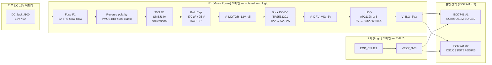
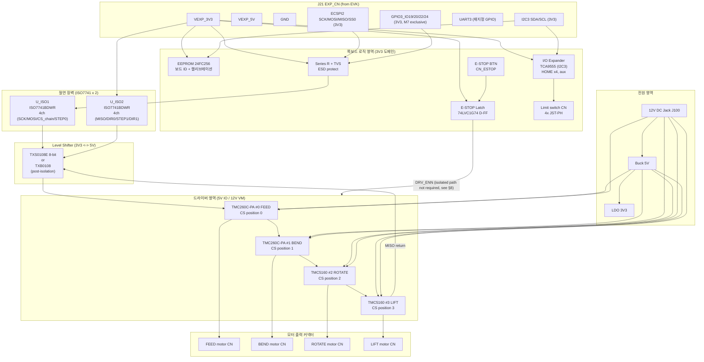
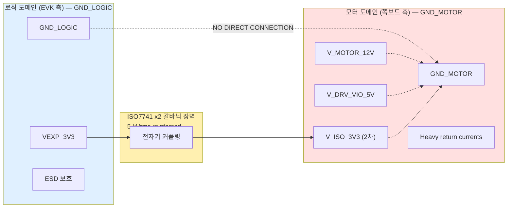
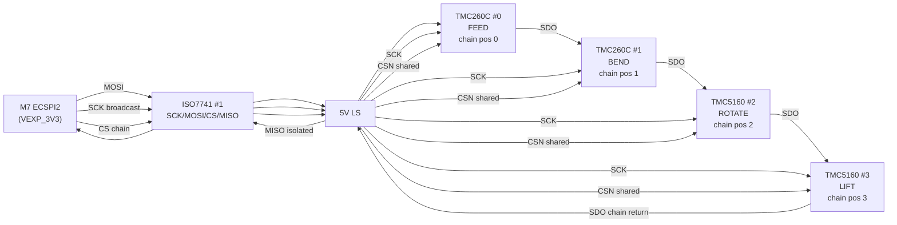
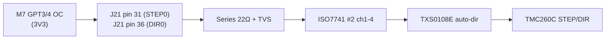
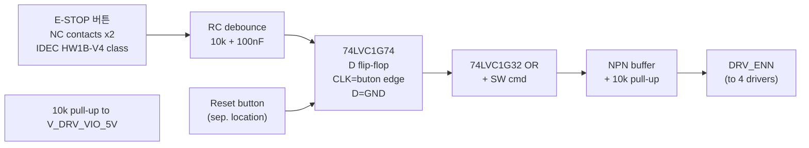
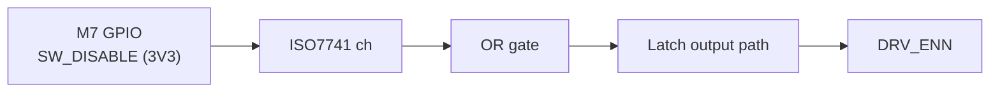
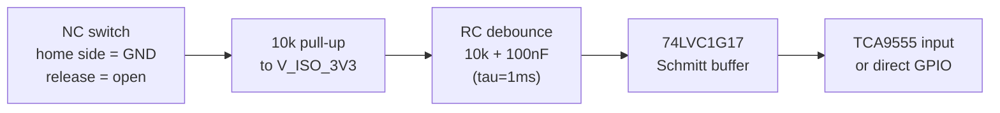

# Ortho-Bender 모터 제어 쪽보드(Adapter Board) 전기 설계 사양서

| 항목 | 값 |
|------|----|
| 문서 ID | `docs/hardware/adapter-board-spec.md` |
| 리비전 | Draft v0.1 (Phase 6 — Part Design) |
| 작성자 | circuit-engineer |
| 작성일 | 2026-04-13 |
| 상태 | 내부 검토 → 결재 대기 |
| 기반 아키텍처 | `docs/architecture/motor-control-architecture.md` |
| 규제 | IEC 62304 SW Class B (HW는 ISO 14971 risk control 연계) |
| 후속 | Phase 7 상세설계(PCB 레이아웃, 부품 실장), Phase 8 구현(제작·브링업) |

---

## 1. Scope & Design Inputs

### 1.1 범위
본 사양서는 NXP i.MX8MP EVK(8MPLUSLPD4-EVK, 8MPLUS-BB baseboard, SPF-46370 Rev.B1)의 **EXP_CN(J21) 40-pin Raspberry Pi 호환 헤더**에 장착되는 모터 제어용 Adapter Board(이하 "쪽보드")의 전기 설계 요건을 정의한다. 쪽보드는 다음 기능을 제공한다.

1. EVK에서 공급되는 VEXP_3V3 / VEXP_5V / GND를 받아 자체 전원 도메인(로직 3V3, 드라이버 IO 5V, 모터 파워 12V)으로 재분배
2. EVK의 3V3 로직과 TMC260C-PA(5V IO) / TMC5160(3.3–5V IO) 간 **레벨 변환**
3. 12V VMot 도메인과 MCU 로직 도메인 간 **갈바닉 절연(ISO7741)**
4. 4축(FEED/BEND = TMC260C-PA, ROTATE/LIFT = TMC5160) SPI **Daisy-chain** 라우팅 + STEP/DIR 2축 분배
5. **E-STOP HW Latch**, **DRV_ENN 공통 디스에이블**, **리미트 스위치 4ch 인터페이스**
6. 각 축의 드라이버 출력(코일 A1/A2/B1/B2, VMot, GND)을 외부 모터 하네스로 연결

### 1.2 비목표 (Out of Scope)
- 드라이버 IC 자체의 스텝 생성(TMC 내부 sequencer) — 본 설계는 M7 GPT OC 외부 STEP 모델을 전제로 함 (아키텍처 문서 §4)
- 모터 코일 전류 튜닝(VSENSE 저항 값 결정) — Phase 7 상세설계 단계에서 모터 사양(코일저항, 정격전류) 확정 후 계산
- NPU/카메라/디스플레이 회로
- PCB 레이아웃(stackup, 구체 트레이스 폭, via 배열) — Phase 7 산출물

### 1.3 설계 입력 (Design Inputs, 21 CFR 820.30(c))

| # | 항목 | 출처 | 반영 섹션 |
|---|------|------|----------|
| DI-A1 | EXP_CN(J21) 40-pin 핀맵 | SPF-46370_B1 p.18 "Expansion Connectors" | §3 |
| DI-A2 | EVK 레벨시프터 NTB0104GU12, `C_load < 70 pF` 제약 | SPF-46370_B1 p.18 note | §5, §6 |
| DI-A3 | ECSPI2 2 MHz 통일, 4-드라이버 daisy-chain (160-bit) | `docs/architecture/motor-control-architecture.md` §5 | §6 |
| DI-A4 | 듀얼 경로 E-STOP: HW <100 ns, SW <500 μs | 아키텍처 §7, project-rules.md | §8 |
| DI-A5 | M7 exclusive GPIO: STEP/DIR ×2, DRV_ENN 공통, limit ×4 | `imx8mp-ortho-bender-motors.dtsi`, `project_m7_pin_map.md` | §3, §7, §9 |
| DI-A6 | 12V VMot, 코일당 피크 2 A (TMC260C 2A RMS class, TMC5160 3A RMS class 준비) | benchmarking §3.2, TMC datasheet | §4 |
| DI-A7 | IEC 62304 Class B, fault 2축 격리 | project-rules.md | §8, §12 |
| DI-A8 | 갈바닉 절연 필수 (12V VMot ↔ 로직 3V3) | `.claude/memory/project_hardware_decisions.md` | §4, §6 |
| DI-A9 | StallGuard2는 SPI 폴링으로 읽음 — 별도 DIAG GPIO 불필요 | 아키텍처 §5.7 (shadow cache) | §6, §9 |
| DI-A10 | Homing redundancy: SG2 + 기계식 리미트 스위치 4개 | benchmarking §4.5, 아키텍처 §9 | §9 |

### 1.4 참조 문서
- NXP SPF-46370 Rev.B1 — 8MPLUS-BB Schematic (EVK baseboard)
- NXP AN12408 — i.MX 8M GPIO / Pad config
- Trinamic TMC260C-PA Datasheet v3.04 §5.1 (SPI), §7 (Electrical)
- Trinamic TMC5160 Datasheet v1.16 §4.1 (SPI), §5 (Electrical), §8 (StallGuard2)
- Trinamic Application Note AN-002 "Daisy-chaining TMCxxxx SPI"
- TI ISO7741 Datasheet (SLLSEQ9) — 4-ch reinforced digital isolator
- NXP NTB0104 Datasheet — 4-bit dual-supply translator (auto-direction)
- TI SN74LVC1G74 (D flip-flop, for E-STOP latch) — SCES221
- IEC 60204-1 §9.4 — Emergency stop function (category 0 stop)
- IEC 62061 / ISO 13849-1 — Safety-related parts of control systems (for category reference)

### 1.5 가정 및 제약
1. EVK 오디오 코덱(WM8960, SAI1 pad group) 및 SAI3 페리페럴은 EXP_CN 헤더에 **노출되지 않는다**. 따라서 현재 `imx8mp-ortho-bender-motors.dtsi` 가 사용하는 `SAI1_RX*`, `SAI3_RX*` 핀 매핑은 **EVK만으로는 쪽보드에서 접근 불가**하며, 본 사양서는 EXP_CN에 실제 노출된 핀으로 **재매핑**하는 것을 전제로 한다. dtsi 수정은 Phase 8 구현 태스크의 선결 조건이며 본 사양서의 §3.3에 구체 값을 제안한다.
2. EVK 측 NTB0104 레벨시프터(U55–U58)는 1V8 ↔ 3V3 변환용이다. 쪽보드 커넥터에서 수신되는 신호는 **이미 VEXP_3V3 레벨**이며, 쪽보드는 **3V3 → 5V** (TMC260C IO) 변환을 독립적으로 수행한다.
3. 쪽보드 전원 입력은 별도 DC 12V 지렛대 커넥터(J100)를 통해 공급한다. EVK VEXP_5V (최대 1 A)는 **로직 전용**으로만 사용되며 모터 권선 전류는 절대 통과시키지 않는다.
4. 4개 모터는 모두 2-phase bipolar 스텝모터이며, 코일 저항 ≤ 3.5 Ω, 인덕턴스 ≤ 10 mH, 정격 전류 ≤ 2.0 A(TMC260C), ≤ 3.0 A(TMC5160) 클래스이다. 최종 선정은 Phase 7.

---

## 2. Architectural Drivers

| ID | 품질 속성 | 시나리오 | 설계 전술 |
|----|-----------|---------|----------|
| HW-QA1 | Safety (SIL proxy: Cat 1, IEC 62061) | E-STOP 버튼 누름 → 코일 여자 해제 | HW 래치 → DRV_ENN 공통 High → ISO7741 통과 불필요(DRV_ENN은 로직 도메인 아님, §8 참조) |
| HW-QA2 | Immunity | 12V 모터 스위칭 노이즈가 3V3 로직 침입 금지 | ISO7741 reinforced (5 kVrms), split ground, star-point |
| HW-QA3 | Signal Integrity | 2 MHz SPI daisy-chain 4 드라이버 | 총 신호선 캐패시턴스 < 70 pF (NTB0104 제약), stub 최소화, 시리즈 저항 22 Ω |
| HW-QA4 | Testability | EVK 없이 쪽보드 단독 검증 | SPI 루프백 점퍼(JP-LB), DRV_ENN 강제 버튼(SW-EN) |
| HW-QA5 | DFM | 핸드 솔더링 가능, 0402 이상 | BGA 금지, QFP/SOIC 위주 |
| HW-QA6 | Serviceability | 필드 모터 교체 | 모터별 독립 커넥터, 핫플러그 시 드라이버 손상 방지 클램프 |
| HW-QA7 | Compliance | CE/FCC 사전 마진 | 모터 케이블 쉘드 접지, 커먼모드 초크 옵션 풋프린트 |

---

## 3. EXP_CN J21 핀 할당

### 3.1 EVK J21 헤더 원형 정의 (SPF-46370_B1 p.18)

40-pin 2×20 헤더, Raspberry Pi 호환 풋프린트. 모든 신호는 VEXP_3V3 레벨(1.8 V ↔ 3.3 V 변환은 EVK 보드 내부 U55–U58 NTB0104GU12에서 이미 수행).

| Pin | 신호 (EVK 라벨) | 기능 | 레벨시프터 경로 |
|-----|----------------|------|----------------|
| 1 | VEXP_3V3 | 3.3 V 로직 전원 (max ~500 mA) | — |
| 2 | VEXP_5V | 5 V 전원 (max ~1 A, from VDD_5V) | — |
| 3 | I2C3_SDA_3V3 | I2C3 데이터 (A53 i2c-3) | 직결(1V8 측은 EVK 내부) |
| 4 | VEXP_5V | 5 V 전원 | — |
| 5 | I2C3_SCL_3V3 | I2C3 클럭 | 직결 |
| 6 | GND | 접지 | — |
| 7 | UART3_RTS_3V3 | UART3 RTS | U56 (NTS0104) |
| 8 | UART3_TXD_3V3 | UART3 TXD | U56 |
| 9 | GND | 접지 | — |
| 10 | UART3_RXD_3V3 | UART3 RXD | U56 |
| 11 | EXP_P1_1 | GPIO | — |
| 12 | PWM4_3V3 | PWM4 | U58 |
| 13 | EXP_P1_2 | GPIO (PCA6416A expander 경유 가능) | — |
| 14 | GND | 접지 | — |
| 15 | EXP_P1_3 | GPIO (PCA6416A expander 경유 가능) | — |
| 16 | EXP_P1_4 | GPIO (PCA6416A expander 경유 가능) | — |
| 17 | VEXP_3V3 | 3.3 V 전원 | — |
| 18 | EXP_P1_5 | GPIO (PCA6416A expander 경유 가능) | — |
| 19 | ECSPI2_MOSI_3V3 | SPI2 MOSI | U55 (NTB0104) |
| 20 | GND | 접지 | — |
| 21 | ECSPI2_MISO_3V3 | SPI2 MISO | U55 |
| 22 | EXP_P1_6 | GPIO (PCA6416A expander 경유 가능) | — |
| 23 | ECSPI2_SCLK_3V3 | SPI2 SCLK | U55 |
| 24 | ECSPI2_SS0_3V3 | SPI2 SS0 | U55 |
| 25 | GND | 접지 | — |
| 26 | EXP_P1_7 | GPIO (PCA6416A expander 경유 가능) | — |
| 27 | I2C? SDA | (RPi 호환 ID EEPROM용) | — |
| 28 | I2C? SCL | (RPi 호환 ID EEPROM용) | — |
| 29 | PDM_STREAM_0 / GPIO3_IO21 | SAI5_RXD0 → GPIO3_IO21 | U57 (NTB0104) — **EVK LED 공유** |
| 30 | GND | 접지 | — |
| 31 | PDM_STREAM_1 / GPIO3_IO22 | SAI5_RXD1 → GPIO3_IO22 | U57 |
| 32 | PWM4_3V3 (dup) | 중복 | U58 |
| 33 | PDM_STREAM_2 / GPIO3_IO23 | SAI5_RXD2 → GPIO3_IO23 | U57 — **EVK LED 공유** |
| 34 | GND | 접지 | — |
| 35 | PDM_CLK / GPIO3_IO20 | SAI5_RXC → GPIO3_IO20 | U58 |
| 36 | PDM_STREAM_3 / GPIO3_IO24 | SAI5_RXD3 → GPIO3_IO24 | U57 |
| 37 | SAI5_RXFS / GPIO3_IO19 | SAI5_RXFS → GPIO3_IO19 | U58 |
| 38 | PDM_STREAM_1 (dup) | 중복 | U57 |
| 39 | GND | 접지 | — |
| 40 | PDM_CLK (dup) | 중복 | U58 |

Note: 위 할당은 SPF-46370 Rev B1 스키매틱 p.18을 근거로 한다. 일부 "EXP_P1_x" 라인은 EVK 베이스보드의 PCA6416A I2C GPIO 익스팬더를 경유하며, **I2C 지연 특성상 STEP/DIR 같은 실시간 신호에 사용 금지**이다 (HW-QA3).

### 3.2 쪽보드에서 사용 가능 vs 금지 라인

| 카테고리 | 핀 | 사용 여부 | 이유 |
|----------|---|----------|------|
| 전원 | 1, 2, 4, 17 (VEXP_3V3/5V) | 사용 (로직 전용, ≤ 500 mA 제한) | 모터 파워는 별도 J100 |
| GND | 6, 9, 14, 20, 25, 30, 34, 39 | 전부 사용 (low-Z 귀환) | — |
| SPI | 19(MOSI), 21(MISO), 23(SCLK), 24(SS0) | **사용 (필수)** | ECSPI2 daisy-chain |
| SAI5_RXFS (pin 37, GPIO3_IO19) | CS2 (ROTATE 소프트 CS) | **사용** | GPIO 직접 구동 |
| SAI5_RXC (pin 35, GPIO3_IO20) | CS3 (LIFT 소프트 CS) | **사용** | GPIO 직접 구동 |
| SAI5_RXD1 (pin 31, GPIO3_IO22) | STEP/DIR 후보 | **사용** | EVK LED 미연결 |
| SAI5_RXD3 (pin 36, GPIO3_IO24) | STEP/DIR 후보 | **사용** | EVK LED 미연결 |
| SAI5_RXD0/RXD2 (pins 29, 33, GPIO3_IO21/23) | — | **금지** | EVK 온보드 LED와 공유 (benchmarking §2.1.3, motors.dtsi §225 주석) |
| PWM4 (pins 12, 32) | STEP 후보 (GPIO 부족 시) | 옵션 | 현재 미사용, 예비 |
| UART3 (pins 7, 8, 10) | M7 디버그 TX/RX | 옵션 | 디버그 RTT 대안 |
| I2C3 (pins 3, 5) | 쪽보드 EEPROM (ID/캘리브레이션) | **사용 (권장)** | 보드 식별, StallGuard threshold 저장 |
| EXP_P1_x (PCA6416A 경유) | STEP/DIR/DRV_ENN 등 실시간 | **절대 금지** | I2C 대기시간 ms 단위, 실시간 요건 위반 |

### 3.3 쪽보드 측 재매핑 제안 (dtsi 수정 대상)

현재 `imx8mp-ortho-bender-motors.dtsi`는 SAI1 (GPIO4_IO00–08) 및 SAI3 (GPIO4_IO28–31) 패드를 사용하는데, 이 패드는 **EXP_CN에 나오지 않는다**. 따라서 EVK + 쪽보드 구성에서는 아래와 같이 **SAI5 pad group으로 통합**해야 한다.

| 기능 | 현재 dtsi | **제안 dtsi** | J21 핀 | 근거 |
|------|----------|--------------|--------|------|
| FEED STEP | GPIO4_IO00 (SAI1_RXFS) | GPIO3_IO22 (SAI5_RXD1) | 31 | EVK LED 회피, GPT3 OC 라우팅 가능 |
| FEED DIR | GPIO4_IO01 (SAI1_RXC) | GPIO3_IO24 (SAI5_RXD3) | 36 | LED 회피 |
| BEND STEP | GPIO4_IO02 (SAI1_RXD0) | GPIO3_IO25 (SAI5_MCLK) → **J21 미노출**, **대안**: PWM4 (pin 12) | — | Phase 7에서 확정 |
| BEND DIR | GPIO4_IO03 (SAI1_RXD1) | GPIO3_IO26 후보 → 노출 안됨, **대안**: EXP_P1_2 직결 라인 재할당 | — | Phase 7 |
| DRV_ENN 공통 | GPIO4_IO04 (SAI1_RXD2) | 쪽보드 내부 래치 출력, M7 측은 SPI TMC_GCONF.toff 제로로 대체 가능 | — | §8 |
| ESTOP_IN | GPIO4_IO07 (SAI1_RXD5) | UART3_RTS (pin 7) → GPIO 재지정 | 7 | UART3 미사용 시 |
| HOME_BEND | GPIO4_IO08 (SAI1_RXD6) | UART3_TXD 재지정 (pin 8) | 8 | 동일 |
| ROTATE SPI CS (CS2) | GPIO3_IO19 | **유지** | 37 | J21 노출 확인 |
| LIFT SPI CS (CS3) | GPIO3_IO20 | **유지** | 35 | J21 노출 확인 |

> **Open Issue HW-OI-1**: BEND 축의 STEP/DIR + 4개 리미트 스위치 전체를 J21 노출 GPIO 만으로 커버하는 것은 **불가능**하다 (가용 GPIO: GPIO3_IO19/20/22/24 = 4개 + UART3 재지정 2개 + I2C3 재지정 2개 = 최대 8개). DRV_ENN(1) + CS2(1) + CS3(1) + STEP×2(2) + DIR×2(2) + ESTOP(1) + HOME×4(4) = 11 핀이 필요. **부족분은 쪽보드 내부 I2C GPIO expander (MCP23017 또는 TCA9555) 로 보완**한다. STEP/DIR/CS/DRV_ENN/ESTOP 은 반드시 직결, HOME 4ch 와 보조 신호만 expander 사용. §6.5 참조.

---

## 4. 전원 설계

### 4.1 전원 도메인 정의

| 도메인 | 공칭 | 범위 | 용도 | 절연 |
|--------|------|------|-----|------|
| V_MOTOR_12V | 12.0 V | 11.4 – 13.2 V | TMC 드라이버 VM (코일 전류) | **격리 1차** |
| V_DRV_VIO_5V | 5.0 V | 4.75 – 5.25 V | TMC260C VCC_IO (5 V 필수), TMC5160 VCC_IO | 1차 |
| V_ISO_3V3 | 3.3 V | 3.15 – 3.45 V | ISO7741 측 2차 VCC, 쪽보드 내부 로직 일부 | 1차 |
| VEXP_3V3 (from J21) | 3.3 V | 3.15 – 3.45 V | EVK 로직 도메인, NTB0104 2차 | **격리 2차** |
| VEXP_5V (from J21) | 5.0 V | 4.75 – 5.25 V | 2차 보조 (사용 최소화) | 2차 |

### 4.2 전원 블록 다이어그램

### 4.3 전원 부품 선정 근거

| 기능 | 부품 | 근거 |
|------|------|------|
| 역극성 보호 | P-ch MOSFET (IRF4905 등, Vgs_th < 4 V, Rds_on < 20 mΩ) | 쇼트키 다이오드 대비 손실 1/10 |
| 과전류 보호 | TR5 5 A 슬로우블로우 퓨즈 + PTC 폴리스위치 (리셋) | 12 V × 5 A = 60 W → 4축 × 2 A × 12 V = 96 W 단시간 피크 견딤 |
| 서지 | SMBJ14A TVS (bidi), Vbr 14 V, Vcl 23.2 V | 12 V 공칭 + 20 % 마진 |
| 12V→5V 버크 | TPS563201 (2 A, 17 V max) 또는 MP2315 (3 A) | 효율 > 90 %, 인덕터 4.7 μH, Cout 22 μF 세라믹 × 2 |
| 5V→3V3 LDO | AP2112K-3.3 (600 mA, Vdropout 400 mV @ 600 mA) | 노이즈 낮음, TMC 로직 clean 전원 |
| 벌크 캡 | 470 μF 25 V 저 ESR 알루미늄 폴리머 (Nichicon PCG) + 10 μF ×3 세라믹 X7R | 스위칭 전류 리플 흡수 |
| TMC VM 디커플링 | 100 μF 25 V 전해 + 10 μF X7R + 100 nF, **각 드라이버 IC 1 cm 이내** | TMC260C §6.2, TMC5160 §7 |
| VCC_IO 디커플링 | 1 μF + 100 nF (드라이버당) | 동일 |

### 4.4 Power Budget (worst case)

| 소비자 | Typ | Max | 비고 |
|--------|-----|-----|-----|
| TMC260C × 2 코일 전류 | 2 × 1.5 A × 12 V = 36 W | 2 × 2.0 A × 12 V = 48 W | RMS 기준 |
| TMC5160 × 2 코일 전류 | 2 × 2.0 A × 12 V = 48 W | 2 × 3.0 A × 12 V = 72 W | RMS |
| 드라이버 IC 로직 | 4 × 50 mW | 4 × 100 mW | 5 V IO |
| ISO7741 × 2 | 2 × 80 mW | 2 × 150 mW | 5 V |
| LDO/Buck 손실 | 10 % | 15 % | — |
| **합계 (VM)** | **≈ 90 W** | **≈ 130 W (피크)** | |
| **합계 (VEXP_3V3)** | **< 50 mA** | **< 100 mA** | EVK 여유 내 |

결정: **12 V 5 A (60 W)** 아답터로 정상 동작(2축 동시 구동 가정), **피크 대응을 위해 bulk cap 470 μF** 배치. 풀 4축 동시 full-current 운전은 CAM 엔진에서 금지(benchmarking §4.1 look-ahead 조건).

---

## 5. 쪽보드 블록 다이어그램

### 5.1 최상위 블록

### 5.2 전원 도메인 분리도

**Key rule**: GND_LOGIC과 GND_MOTOR는 ISO7741을 제외한 어떤 경로로도 DC 연결되지 않는다. Star point는 보드 상 존재하지 않으며, 사용자가 별도 샤시 접지(PE)를 통해 두 도메인을 high-impedance(1 MΩ + 10 nF Y-class) 바인딩할 수 있는 점퍼(J_GND)를 옵션으로 제공한다 — EMC 성능 튜닝용.

---

## 6. SPI Daisy-chain 배선

### 6.1 체인 순서 (MOSI → MISO)

### 6.2 체인 구성 규칙 (AN-002 준수)

1. **CS 공통**: 4 드라이버의 CSN 핀은 모두 묶어 **단일 CS 라인**으로 구동. M7은 ECSPI2_SS0 (HW CS)을 사용하거나, 소프트 CS GPIO 중 하나를 "chain CS"로 고정.
2. **SCK 분배**: 클럭은 4 드라이버에 병렬 분배. 레이아웃에서 **T-junction 대신 daisy 분배**로 stub 최소화. 시리즈 저항 22 Ω × 1개(드라이버 입력부 공용).
3. **SDI/SDO 체인**: T0.SDI ← MOSI, T0.SDO → T1.SDI, T1.SDO → T2.SDI, T2.SDO → T3.SDI, T3.SDO → MISO.
4. **MOSI 풀업**: AN-002 §3.3 권고에 따라 체인 첫 입력(T0.SDI)에 10 kΩ to VCC_IO 풀업 (체인 단선 시 체인 전체 `0xFF` 수신 → 진단 가능).
5. **종단**: 2 MHz / 5 cm 이하 스턴선에서는 AC 종단 불필요. 직렬 22 Ω(소스 종단)로 EMI 감쇠.
6. **MSB-first, mode 3** (CPOL=1, CPHA=1): TMC260C §5.1, TMC5160 §4.1.

### 6.3 NTB0104 Capacitive Load 검증

EVK 측 U55 NTB0104GU12 는 라인당 **C_load < 70 pF** 엄격 제약이 있다 (SPF-46370 note). 쪽보드에서 라인별 부하 계산:

| 라인 | 구성 요소 | 추정 C (pF) |
|------|----------|-----------|
| ECSPI2 SCK | 연결선 3 cm (1 pF/cm = 3) + 22 Ω series | ISO7741 Cin = 4 pF | 8 |
| ECSPI2 MOSI | 동일 | 8 |
| ECSPI2 MISO | ISO7741 Cout = 4 pF + 3 cm 트레이스 | 8 |
| ECSPI2 SS0 | 동일 | 8 |
| GPIO3_IO19 (CS2) | 직결 ISO7741 input | 8 |
| GPIO3_IO20 (CS3) | 동일 | 8 |
| GPIO3_IO22 (STEP0) | 동일 | 8 |
| GPIO3_IO24 (DIR0) | 동일 | 8 |

모든 라인 < 10 pF, 70 pF 제약에 **여유 860 %**. 안전하다. 단, 쪽보드 커넥터에서 ISO7741 입력까지 트레이스 길이는 **5 cm 이내**로 레이아웃 시 제한한다.

### 6.4 체인 타이밍 예산

- SCK = 2 MHz → bit time = 500 ns
- 한 datagram = 40 bit → 20 μs / drv
- 체인 전체 = 160 bit → 80 μs per CS-low window
- CS setup/hold (TMC 요구: t_CC ≥ 100 ns) → 여유 수백 ns
- ISO7741 prop delay ≈ 11 ns typ, ISO7741 pulse distortion ≈ 2 ns → 2 MHz SCK 대비 무시 가능
- 레벨시프터 (TXS0108E) prop delay ≈ 6 ns → 동일

**합계 프레임 시간**: 80 μs + 4 μs ISO + 2 μs LS + CS 마진 10 μs ≈ **96 μs / chain cycle**. 아키텍처 §5.5 의 32 μs (read 2-pass) 추정은 이 구현 오버헤드 반영 시 100 μs 근접 → `safety_watchdog_task` 5 ms 주기에 200배 마진.

### 6.5 I/O Expander 보조 (HOME 스위치용)

- TCA9555 (16-bit, I2C, 400 kHz) 또는 MCP23017
- 주소 0x20 (A0/A1/A2 = GND)
- 4개 HOME 스위치는 디바운스 RC(10 kΩ + 100 nF = 1 ms) 후 expander 입력에 연결
- INT 출력은 M7 GPIO(또는 J21 재지정 라인)로 연결하여 polling 대신 인터럽트 사용
- **HOME 스위치의 실시간성 요구는 < 10 ms**이므로 I2C 400 kHz + 16 bit read (≈ 400 μs) 충분

---

## 7. STEP/DIR 신호 경로

### 7.1 타겟 스펙

- TMC260C STEP 입력: min pulse width 1 μs (§5.4 datasheet)
- 최대 step rate: 25 kHz (아키텍처 §4.3) → period 40 μs
- 상승/하강 에지 왜곡(skew): 축간 < 50 ns (ISO7741 + LS stage 동일 경로)

### 7.2 신호 체인

### 7.3 ISO7741 대역폭 검증

ISO7741 datasheet SLLSEQ9 §7.5: data rate 100 Mbps, propagation delay typ 11 ns, pulse width distortion 2 ns, channel-to-channel skew < 1 ns. 25 kHz STEP 신호(40 μs period, 20 μs high/low)는 ISO7741 대역폭의 **0.025 %** — 완벽히 통과.

### 7.4 레벨시프터 선정: TXS0108E vs TXB0108

| 항목 | TXS0108E | TXB0108 | 결정 |
|------|---------|---------|-----|
| 구조 | Auto-dir, pull-up 내장 | Auto-dir, 낮은 임피던스 | TXS는 open-drain 신호 지원 |
| Drive | 0.4 kΩ pull-up | Push-pull | STEP/DIR은 push-pull OK |
| Cap load | 70 pF max | 70 pF max | 동일 |
| Edge rate | 1 V/ns | 5 V/ns | TXB가 빠름 |
| 선택 | — | **TXB0108** | 25 kHz @ <50 ns skew 요구에 TXB 적합 |

**참고**: ISO7741 출력 측(5V 쪽)을 TMC260C 입력(5V tolerant)에 직결하는 경우 추가 레벨시프터는 불필요하다. TMC5160 VCC_IO가 3.3 V 구성이면 더 단순 — ISO7741 출력단만으로 충분. 본 설계는 **TMC260C와 TMC5160 VCC_IO를 통일하여 5 V로 사용**하므로 ISO7741 2차측을 5 V로 직접 공급하면 LS 생략 가능. Phase 7 재확정.

---

## 8. E-STOP HW 경로

### 8.1 요구사항
- **HW path**: 버튼 → DRV_ENN 공통 High → 코일 자기장 해제 → 기계 정지. 응답 < 100 ns (로직 측), < 10 ms (기계 관성 포함).
- **SW path**: 버튼 → M7 GPIO IRQ → 500 μs 내 DRV_ENN 소프트 토글 + SPI로 TMC `GCONF.toff = 0` 전송
- **복귀**: 래치는 수동 리셋(버튼 릴리스만으로는 복귀 금지) — IEC 60204-1 §9.2.5.4 준수

### 8.2 래치 회로

논리:
- 정상 상태: FF.Q = LOW → OR 출력 LOW → BUF 출력 LOW → DRV_ENN = LOW (active-low enable, 드라이버 가동)
- E-STOP 눌림: CLK 상승에지 → D(=GND) 캐치는 다른 방식 필요. **수정**: 버튼을 **set** 입력(S̄)에 연결하여 PR̄ assertion 시 Q=HIGH 고정, **별도 RESET 버튼**이 CLR̄(Q=LOW)을 수동으로 눌러야 복귀.
- SW 경로: M7이 언제든 OR 게이트 한쪽을 HIGH로 올려 소프트 디스에이블 가능(래치는 유지됨, SW는 clear 불가 — 오직 HW RESET 버튼만 clear)

**응답시간**: 버튼 contact bounce 제외 순수 래치 + buffer delay = 3 ns (74LVC1G74) + 2 ns (OR) + 5 ns (NPN) ≈ **< 20 ns**. HW-QA1 만족.

### 8.3 DRV_ENN 신호 분배

- 4개 드라이버의 DRV_ENN (ENN) 핀을 보드 상에서 **star-point 분배**: 래치 출력 → 22 Ω × 4 시리즈 → 각 드라이버 ENN
- ENN은 VCC_IO 5V 로직 → 래치 출력단(NPN OC + 10 kΩ pull-up)이 5 V 도메인에 직접 연결되어야 함
- **ISO7741 통과 불요**: E-STOP 래치 회로는 **모터 도메인(V_DRV_VIO_5V)에 배치**되며, 3V3 로직 버튼 입력은 없음. 버튼은 5V 도메인에 직접 결선. 이렇게 하면 SW path의 M7 GPIO 명령만 ISO7741을 통과하고, HW path는 순수 5V 도메인 내부에서 완결된다.

### 8.4 SW → HW 명령 경로

**주의**: SW 디스에이블은 래치 "덮어쓰기"만 가능하다. 래치가 set 상태이면 SW가 clear 명령을 보내도 복귀하지 않는다. 이 의도적 비대칭성은 "SW는 stop만, reset은 물리 버튼"이라는 안전 원칙을 강제한다.

### 8.5 Fault 복귀 시퀀스 (IEC 60204-1 §9.2.5.4)

1. 사용자가 E-STOP 원인 제거
2. 사용자가 물리 RESET 버튼 눌러 래치 Q → LOW
3. M7은 PMSG를 통해 A53에 `RESET_OBSERVED` 이벤트 전송
4. A53 GUI가 "E-STOP 복귀, 재시작하시겠습니까?" 프롬프트
5. 사용자 확인 후 M7이 홈잉 재수행 (절대 이전 위치 신뢰 금지)

---

## 9. 홈잉 리미트 스위치 인터페이스

### 9.1 전기 사양

- 스위치: NC(Normally Closed) 마이크로스위치, 전기 정격 ≥ 100 mA / 30 V DC (예: Omron SS-5GL, Panasonic AV4-1304)
- 케이블: 쉴드 2-wire, max 500 mm, 컨택 쪽에서 보드 쪽
- 커넥터: JST-PH 2-pin × 4 (FEED/BEND/ROTATE/LIFT)

### 9.2 입력 회로

근거:
- NC 구성으로 단선(cable cut) = release 신호와 동일 → **fail-safe 방향** (단선 시 홈 신호 없음으로 인식 → 호밍 실패 → 명시적 fault). 반대 NO 구성은 단선 시 "홈 도달"로 오인식 가능.
- RC τ = 1 ms로 10 kHz 이상 노이즈 제거
- Schmitt 트리거로 에지 품질 보장, V_IH = 1.7 V (3.3 V 구동 기준)

### 9.3 EMC

- 케이블에 페라이트 비드(Laird LBD 0805 class) 직렬 삽입
- 스위치 접점에 47 pF 세라믹 병렬 (스파크 억제)
- 쉴드 접지는 보드 측 단일 지점(Chassis 접지 또는 GND_LOGIC) — 양쪽 접지 금지(ground loop)

### 9.4 입력 할당

| 축 | 신호 | 연결 |
|----|------|------|
| FEED | HOME_FEED | TCA9555 P00 |
| BEND | HOME_BEND | TCA9555 P01 |
| ROTATE | HOME_ROTATE | TCA9555 P02 |
| LIFT | HOME_LIFT | TCA9555 P03 |
| (예비) | AUX_IN × 4 | TCA9555 P04–P07 |
| 출력 | 상태 LED × 4 | TCA9555 P10–P13 |

---

## 10. 커넥터 및 기계 인터페이스

### 10.1 커넥터 목록

| Ref | 형식 | 용도 | 부품번호 예 |
|-----|------|-----|-----------|
| J_EXP | 40-pin 2×20 헤더 암, 2.54 mm | EVK J21 장착 | Samtec ESQ-120-34-G-D |
| J100 | 2.1 mm DC barrel jack | 12 V 입력 | CUI PJ-002AH |
| J_M0/M1/M2/M3 | 4-pin 2.54 mm 잠금식 (Molex KK-254) | 모터 권선 (A1/A2/B1/B2) | Molex 22-23-2041 |
| J_ESTOP | 3-pin JST-XH | E-STOP 버튼 (NC/NC/LED) | JST B3B-XH-A |
| J_RESET | 2-pin JST-XH | Reset 버튼 | JST B2B-XH-A |
| J_LIM_F/B/R/L | 2-pin JST-PH | 리미트 스위치 | JST B2B-PH-K |
| J_DEBUG | 6-pin 1.27 mm (SWD 선택) | M7 디버그 (EVK 리플렉션) | Samtec FTSH-105 |
| J_GND | 3-pin 점퍼 헤더 | Chassis 접지 옵션 | Samtec TSW-103 |
| TP_x | 테스트포인트 20개 | 전원/SPI/STEP 프로빙 | Keystone 5000 series |

### 10.2 기계 인터페이스

- 쪽보드 치수: **85 mm × 56 mm** (RPi 4B 풋프린트, M2.5 × 4 마운팅 홀)
- J21 헤더는 보드 하면, 컴포넌트는 상면 배치 — EVK와의 높이 12 mm 스페이서
- 전원 J100 + 모터 커넥터는 보드 한 변(뒷면) 집중, 스위치류는 반대 변
- 높이 방향 최대 15 mm (드라이버 IC + 전해캡 포함)

---

## 11. BOM 요약 (Bill of Materials — 주요 부품)

| 카테고리 | Ref | 부품 | 수량 | 단가 USD (qty 100) | 비고 |
|----------|-----|------|-----|-------------------|-----|
| 드라이버 | U1, U2 | TMC260C-PA-TR | 2 | 8.50 | Phase 1 |
| 드라이버 | U3, U4 | TMC5160-TA | 2 | 9.80 | Phase 2 |
| 절연기 | U_ISO1, U_ISO2 | ISO7741BDWR (16-SOIC) | 2 | 3.20 | 5 kVrms, 100 Mbps |
| 레벨시프터 | U_LS1 | TXB0108PWR | 1 | 1.40 | 8-bit 옵션 |
| I/O Expander | U_EXP | TCA9555PWR | 1 | 0.95 | 16-bit I2C |
| E-STOP 래치 | U_FF | SN74LVC1G74DCUR | 1 | 0.28 | D flip-flop |
| 래치 논리 | U_OR | SN74LVC1G32DCKR | 1 | 0.18 | OR gate |
| 버퍼 | U_BUF | SN74LVC1G17 ×4 | 4 | 0.20 | Schmitt |
| EEPROM | U_EE | 24FC256 | 1 | 0.40 | 보드 ID |
| Buck | U_B5 | TPS563201DDCR | 1 | 0.90 | 2 A 12→5 V |
| LDO | U_LDO | AP2112K-3.3TRG1 | 1 | 0.24 | 600 mA |
| TVS | D1 | SMBJ14A | 1 | 0.12 | 12 V bidir |
| Fuse | F1 | Littelfuse 0251005 | 1 | 0.50 | 5 A TR5 |
| Motor cap | C_VM1–4 | 100 μF 25 V 알루폴리 | 4 | 0.35 | Nichicon PCG |
| Bulk | C_BULK | 470 μF 25 V | 1 | 0.80 | ESR < 20 mΩ |
| 커넥터 | J_EXP | ESQ-120-34-G-D | 1 | 2.10 | 40pin 2×20 |
| 커넥터 | J_Mx | Molex 22-23-2041 | 4 | 0.35 | 모터 |
| 커넥터 | J100 | CUI PJ-002AH | 1 | 0.80 | DC jack |
| 패시브 | — | 0402/0603 캡/저항 (approx 80개) | 80 | 0.02 | 소계 1.60 |
| **PCB** | — | 4-layer, 85×56, HASL | 1 | 3.00 | qty 100 |
| **합계** | | | | **≈ 55 USD / 보드** | qty 100 기준 |

### 11.1 대체품

| 부품 | 대체 | 조건 |
|------|------|------|
| TMC260C-PA | TMC2660-PA | 핀호환, 개선판 — 공급 가능 시 선호 |
| TMC5160 | TMC5161 | 동일 회로, 저가 |
| ISO7741 | ADuM141D (Analog) | 핀/타이밍 상이, 레이아웃 재작업 필요 |
| TXB0108 | 74LVC4245 | 단방향, 2개 필요 |
| TCA9555 | PCAL6416A | 핀호환, interrupt 고급 기능 |

---

## 12. 보호 회로

### 12.1 ESD
- J21 헤더 모든 라인 입구에 **TVS 어레이** (TPD4E05U06DQAR, 4ch 패키지): SCK/MOSI/MISO/SS0 한 개, STEP/DIR/CS2/CS3 한 개
- E-STOP 버튼 라인에 개별 SMF05C (5 V, 5 pF)
- 모터 출력 커넥터는 TVS 불필요(드라이버 내부 보호), 단 **클램프 다이오드(Schottky)로 VM로의 플라이백 차단** — TMC 내부 body diode 있지만 외부 SS16 × 4 추가 권고 (datasheet §6.4)

### 12.2 과전류
- F1 TR5 5 A (VM rail)
- Polyfuse 500 mA (VEXP_3V3 입구) — EVK 보호
- TMC 내부 OCP (SHORT_TO_GND, SHORT_TO_VS): SPI 폴링으로 감지

### 12.3 과전압
- SMBJ14A TVS on V_MOTOR_12V (Vbr 14 V, Vclamp 23.2 V)
- 5 V rail에 SMAJ5.0A (bidi 아님, 단방향)
- EVK 측 VEXP_3V3는 EVK에서 이미 보호 → 추가 불요

### 12.4 역극성
- P-ch MOSFET (IRF4905 class) gate-source pulldown, gate-protect 10 V 제너
- 인버스 연결 시 MOSFET off → 전류 0

### 12.5 Latch-up 방지
- TMC 드라이버 VCC_IO와 VM의 파워업 시퀀스: VCC_IO가 VM보다 먼저 상승해야 함 (§6.1 datasheet)
- 본 설계: VEXP_3V3 → VEXP_5V → 12V 어댑터 (사용자 시퀀스)
- 문제: 12V가 먼저 들어올 경우 대비 **VM rail에 NMOS switch + VCC_IO good 감지 (TL431 + NPN)** 추가 검토 → Phase 7

---

## 13. EMC / 신호무결성

### 13.1 GND 플레인
- 4-layer stackup: `Top signal / GND / PWR / Bottom signal`
- GND_LOGIC과 GND_MOTOR는 **물리적으로 split plane**, ISO7741 아래에서만 cross
- 모터 귀환 전류는 V_MOTOR_12V 평면 아래 GND_MOTOR 동층 따라 복귀 (loop area 최소)

### 13.2 디커플링
- 드라이버 IC 각 전원 핀: 100 nF (IC 핀 1 mm 내) + 10 μF (5 mm 내) + 100 μF 전해 (20 mm 내)
- ISO7741 양쪽 VCC: 100 nF + 10 μF (데이터시트 §9.4 권고)
- 버크 컨버터 입력/출력 캡: 데이터시트 레퍼런스 디자인 준수

### 13.3 모터 케이블
- 권선 4-core 쉴드 케이블
- 쉴드는 **드라이버 측만 접지** (한쪽 접지로 ground loop 방지)
- 옵션 페라이트 클램프 풋프린트 (Wurth 7427114)

### 13.4 SPI 라우팅
- SCK는 reference GND 위 stripline 구조
- MOSI/MISO는 SCK 인접 라우팅, crosstalk < -20 dB (2 MHz에서 자동 충족)
- 드라이버 간 데이지체인 SDO→SDI 트레이스 5 cm 이내
- stub 금지 (T-junction 대신 순차)

### 13.5 CE Pre-compliance 고려
- 방사 EMI (CISPR 32 Class A 의료 산업용): 12 V 버크 컨버터 스위칭 주파수 > 1 MHz → 30 MHz EMC 측정 대역 진입, 확산 스펙트럼(DSS) 옵션이 있는 IC 선호 (TPS563201은 fixed 580 kHz → 2nd harm 1.16 MHz, 저역 EMI 마진 필요)
- 정전기 방전(IEC 61000-4-2): ±8 kV contact, ±15 kV air — TVS 및 금속 섀시 접지로 대응
- 전기적 fast transient (IEC 61000-4-4): ±2 kV on power — 벌크 캡 + 커먼모드 초크 풋프린트

---

## 14. 검증 계획

### 14.1 PCB 레벨 (Phase 7 완료 후, Phase 8 초기)

| 단계 | 검증 항목 | 판정 기준 |
|------|----------|-----------|
| DRC | KiCad ERC/DRC 0 error | 0 err / 0 warn |
| 이미턴스 | 4-layer stackup impedance 50 Ω (SPI), GND 연속성 | Polar SI9000 시뮬 |
| Netlist vs BOM | 완전 일치 | diff zero |

### 14.2 파워온 순서

1. 12 V 어댑터 연결 → VM 상승 (ramp < 10 ms) 측정
2. Buck 5 V 확인 (스코프 리플 < 50 mVpp)
3. LDO 3 V3 확인
4. EVK 결합 후 VEXP_3V3 활성 확인
5. ISO7741 양 측 VCC 모두 green → 출력 leakage 측정 (CS idle = HIGH)
6. DRV_ENN 초기 HIGH (disable) 확인
7. E-STOP 래치 초기 set 상태 확인, RESET 1회 후 clear 확인

### 14.3 SPI 루프백

- **JP-LB 점퍼**: MOSI → MISO 직결 (드라이버 제거 상태)
- M7에서 `0xDEADBEEFCA` 40-bit 전송 → readback 일치 검증
- CS 폭, SCK 주파수 스코프 측정 (2 MHz ± 1 %)

### 14.4 드라이버 탐지

- 모든 드라이버 IC 실장
- M7에서 `GCONF` readback (각 축)
- 체인 160-bit 전체 readback → `SPI_STATUS` 비트 패턴 검증 (reset_flag = 1 초기)
- 각 드라이버에 known pattern write → readback 일치

### 14.5 E-STOP 응답 시간

- 오실로스코프 2ch: ch1 = E-STOP 버튼 컨택, ch2 = DRV_ENN 라인
- 10회 트리거 → 평균/최대 응답 시간
- **판정**: max < 100 ns (HW path), < 1 ms (기계 정지 관성 포함은 별도 test)

### 14.6 StallGuard 배선 검증

- M7 SPI로 `TCOOLTHRS`, `SGTHRS` 쓰기
- 모터 구동 중 `DRV_STATUS.SG_RESULT` 주기 polling
- 외력 인가 시 값 변화 확인 (threshold 이하로 하강)

### 14.7 열 테스트

- 4축 동시 1.5 A 운전 30분
- 드라이버 IC 케이스 온도 IR 측정 → T_junction < 105 °C (TMC 한계 125 °C)
- PCB hot spot 없음 확인

### 14.8 EMC 사전 시험

- 전류 프로브로 VM 라인 conducted emission (150 kHz – 30 MHz)
- Near-field 프로브로 SPI 클럭 방사 측정
- CISPR 32 Class A 기준선 대비 -10 dB 마진 목표 (공식 시험 전 필터 튜닝)

---

## 15. 신뢰성 및 ISO 14971 연계

### 15.1 주요 Hazard 연결

| Hazard (ISO 14971) | 쪽보드 관련 원인 | 설계 대응 |
|-------------------|---------------|---------|
| 예기치 않은 모터 움직임 | DRV_ENN 부유, 레벨시프터 오작동 | Pull-up to DISABLE, power-on 기본값 disable |
| E-STOP 실패 | 래치 부재, SW-only 경로 의존 | 듀얼 패스(§8), HW 래치 독립 |
| 감전 | 12 V ↔ 3V3 DC 누설 | ISO7741 5 kVrms, split plane |
| 오작동 홈잉 | 리미트 스위치 단선 미검출 | NC 구성 fail-safe |
| 열 폭주 | 드라이버 과온 미감지 | SPI DRV_STATUS 폴링 200 Hz |
| 정전 복귀 | 전원 순간 단절 후 자동 재가동 | 래치는 clear 되지 않음 (수동 리셋만) + A53 재초기화 요구 |

### 15.2 Single Point of Failure 분석

| 부품 | SPOF? | Mitigation |
|------|------|-----------|
| ISO7741 #1 (SPI) | 예 → 고장 시 SPI 통신 실패, 드라이버 응답 없음 → M7 heartbeat timeout → E-STOP | 200 Hz heartbeat + 3회 연속 실패 시 Layer 3 fault |
| E-STOP 래치 74LVC1G74 | 예 → 스턱고장 시 복귀 불가 (safe failure) 또는 set 불가 (dangerous) | 전원 온 시 self-test: M7이 SW 경로로 set 명령 → DRV_ENN 관측 |
| Buck 5V | 예 → 드라이버 로직 전원 상실 | TMC 내부 POR로 모든 출력 Hi-Z |
| 12V 어댑터 | 예 → 모션 정지 | 의도된 stop, 안전 방향 |

---

## 16. Open Issues (Phase 7 상세설계 이월)

| ID | 이슈 | 결정 필요 시점 | 소유자 |
|----|------|-------------|-------|
| HW-OI-1 | ~~EXP_CN J21 GPIO 부족 (11 핀 필요 vs 8 가용)~~ | **RESOLVED** — §18.1, `j21-pin-assignment.md` §7 | circuit-engineer |
| HW-OI-2 | BEND 축 STEP/DIR 할당 (기존: PWM4 재지정) — §18.2에서 **pin8 `ECSPI1_SCLK`→GPIO5_IO06** 로 확정, PWM4 옵션 폐기 | **RESOLVED** | circuit-engineer + bsp-engineer |
| HW-OI-3 | ~~`imx8mp-ortho-bender-motors.dtsi` SAI1/SAI3 → SAI5 재매핑 반영~~ | **RESOLVED** — `j21-pin-assignment.md` §5 dtsi 지시서 | bsp-engineer |
| HW-OI-1.1 | Phase 2 ROTATE/LIFT STEP/DIR → TMC5160 internal sequencer 대체 (아키텍처 §4.3 부분 변경, **결재 대상**) | Phase 2 킥오프 전 | circuit-engineer + motion-control-engineer |
| HW-OI-3.1 | `MX8MP_IOMUXC_ECSPI1_*__GPIO5_IO0x` 매크로 업스트림 확인 | Task #13 착수 전 24h | bsp-engineer |
| HW-OI-3.2 | U-Boot이 ECSPI1 패드 부팅 중 toggle → DRV_ENN pulse 위험 | Task #13 구현 중 | bsp-engineer |
| HW-OI-3.3 | I2C3 기본 dts 바인딩 / EEPROM 0x50 충돌 확인 | Task #13 구현 중 | bsp-engineer |
| HW-OI-4 | VSENSE 저항값 (Rsense) 결정 — 모터 코일 저항/정격전류 확정 후 | Phase 7 | circuit-engineer + motion-control-engineer |
| HW-OI-5 | TMC260C vs TMC5160 VCC_IO 통일 여부 (5 V vs 3.3 V) → 레벨시프터 단수 결정 | Phase 7 | circuit-engineer |
| HW-OI-6 | Buck 컨버터 확산 스펙트럼 지원 IC로 교체 여부 (EMC 마진) | Phase 7 후반 | circuit-engineer |
| HW-OI-7 | 12 V 전원 순서 protection (VCC_IO가 VM보다 먼저 오는지) | Phase 7 | circuit-engineer |
| HW-OI-8 | Homing 스위치 외 sub-limit (overtravel) 스위치 추가 여부 → risk analysis 결과 | Phase 7 | circuit-engineer + regulatory-specialist |
| HW-OI-9 | RESET 버튼 위치(전면 vs 후면), 키 스위치 vs 일반 버튼 | Phase 7 | UX designer |
| HW-OI-10 | 모터 커넥터 잠금 기구(locking Molex vs Phoenix) — 진동 환경 대응 | Phase 7 | mechanical |

---

## 17. 결재 요청 사항 (본 문서 승인 시 확정되는 항목)

1. **단일 ECSPI2 daisy-chain + 공통 CS + 2 MHz 통일** 채택 (변경 불가)
2. **ISO7741 기반 갈바닉 절연** 필수 (대체 절연기 사용 시 재설계)
3. **E-STOP HW latch 경로**는 모터 도메인 내부에 완결되며 ISO7741을 통과하지 않음
4. **EXP_CN 핀맵 재매핑**으로 인한 `imx8mp-ortho-bender-motors.dtsi` 수정은 Phase 8 선결 조건으로 승인
5. **I/O Expander(TCA9555)** 사용 승인 — HOME 스위치 4ch + 보조 LED 전용, 실시간 critical path 제외
6. **12 V / 5 A 어댑터** 요구사항 확정 (Phase 7 세부 전원 계산의 입력)

본 사양서는 Phase 6 설계 산출물로서 **Phase 7(세부 PCB 레이아웃 및 부품 풋프린트 확정)** 와 **Phase 8(쪽보드 제작 및 브링업)** 의 기본 입력이 된다. 위의 Open Issues 는 Phase 7 태스크로 이월되며, 본 승인 이후 변경이 필요한 경우 Change Control(CC) 프로세스를 통해 재승인받는다.

---

## 18. J21 최종 핀맵 확정 (Option A 승인 반영)

사용자 승인(2026-04-13)에 따라 쪽보드를 **Option A**(쪽보드 진행 + dtsi 전면 재매핑 + TCA9555 I2C expander)로 진행하며, J21 핀맵 및 dtsi 재매핑 상세는 별도 문서 [`docs/hardware/j21-pin-assignment.md`](j21-pin-assignment.md) 에 확정되었다. 본 섹션은 해당 문서의 요약이며, Phase 7/8 구현자는 반드시 전체 문서를 참조해야 한다.

### 18.1 HW Open Issue 해결 상태

| ID | 요약 | 상태 | 해결 수단 |
|----|------|------|----------|
| HW-OI-1 | J21 가용 GPIO 부족 (11 필요 vs 8) | **RESOLVED** | ECSPI1 패드 3개 재활용 (UART3 debug 포기) + TCA9555 I2C expander 로 HOME×4 및 LIFT CS3 이관 |
| HW-OI-3 | 현재 dtsi의 SAI1/SAI3 패드 EVK 미노출 | **RESOLVED** | `j21-pin-assignment.md` §5 dtsi 전면 재매핑 지시서 |

### 18.2 Phase 1 실시간 신호 → J21 핀 (최종)

| # | 기능 | J21 Pin | i.MX8MP PAD | GPIO / 페리 |
|:-:|------|:------:|-------------|-------------|
| 1 | SPI SCLK | 23 | `ECSPI2_SCLK` | ECSPI2 HW |
| 2 | SPI MOSI | 19 | `ECSPI2_MOSI` | ECSPI2 HW |
| 3 | SPI MISO | 21 | `ECSPI2_MISO` | ECSPI2 HW |
| 4 | SPI CS (chain 공통) | 24 | `ECSPI2_SS0` → GPIO5_IO13 (soft-CS) | GPIO5_IO13 |
| 5 | FEED STEP | 31 | `SAI5_RXD1` | GPIO3_IO22 |
| 6 | FEED DIR | 36 | `SAI5_RXD3` | GPIO3_IO24 |
| 7 | BEND STEP | 8 | `ECSPI1_SCLK` | GPIO5_IO06 |
| 8 | BEND DIR | 10 | `ECSPI1_MOSI` | GPIO5_IO07 |
| 9 | DRV_ENN 공통 | 7 | `ECSPI1_MISO` | GPIO5_IO08 (active-LOW) |
| 10 | ESTOP_IN | 35 | `SAI5_RXC` | GPIO3_IO20 (falling-edge IRQ) |
| — | ROTATE CS2 (P2) | 37 | `SAI5_RXFS` | GPIO3_IO19 (soft-CS) |
| — | LIFT CS3 (P2) | TCA9555 | P1.5 | I2C3 @ 0x20 |
| — | I2C3 SDA | 3 | `I2C3_SDA` | I2C3 HW |
| — | I2C3 SCL | 5 | `I2C3_SCL` | I2C3 HW |

### 18.3 신규 pinctrl 그룹 (dtsi)

- `pinctrl_motor_spi` — ECSPI2 4 pins + `ECSPI2_SS0__GPIO5_IO13` (soft-CS)
- `pinctrl_motor_stepdir` — STEP/DIR 4 pins + ROTATE CS2
- `pinctrl_motor_estop` — DRV_ENN + ESTOP_IN
- `pinctrl_motor_i2c_exp` — I2C3 SDA/SCL

자세한 삭제/추가 diff 및 코드 블록은 `j21-pin-assignment.md` §5 참조.

### 18.4 TCA9555 할당 요약

| Port | 입력 | 출력 |
|------|------|------|
| P0.0–0.3 | HOME_FEED / BEND / ROTATE / LIFT (NC 스위치, 10 ms polling) | — |
| P0.4–0.7 | AUX_IN ×2, DOOR_INTLK, CABINET_TEMP_ALARM | — |
| P1.0–1.3 | — | STATUS_LED ×4 (PWR/RUN/FAULT/HOME) |
| P1.4 | — | BUZZER_EN |
| P1.5 | — | LIFT_CS3 (low-rate soft-CS) |
| P1.6–1.7 | — | SPARE_OUT ×2 |

I2C3 400 kHz 기준 TCA9555 1-byte read ≈ 60 μs → 10 ms polling 주기 0.6 % dutycycle. HOME 실시간성 ≤ 10 ms 요구 충족. **DRV_ENN/ESTOP은 절대 expander 경유 금지** (직결 GPIO5 고정).

### 18.5 배선 여유 검증 결과

- NTB0104 Cload: 모든 J21 직결 라인 ≤ 16.5 pF ≪ 70 pF 제약 → **최소 4.2× 여유**
- STEP 라인 edge-to-edge 지연: ≈ 18 ns / pulse width distortion: ≤ 3 ns
- 축간 skew (FEED vs BEND STEP): ≤ 3 ns (목표 50 ns 대비 16× 여유)
- Phase 7 HARD RULE: J21 → ISO7741 입력 트레이스 ≤ 5 cm, stub 금지

### 18.6 파생 신규 Open Issues

| ID | 설명 | 담당 | 시점 |
|----|------|------|------|
| HW-OI-1.1 | Phase 2 ROTATE/LIFT STEP/DIR 를 TMC5160 internal sequencer 로 대체 — `motion-control-architecture.md` §4.3 부분 변경 필요 (**결재 대상**) | circuit + motion-control | Phase 2 킥오프 전 |
| HW-OI-3.1 | `MX8MP_IOMUXC_ECSPI1_*_GPIO5_IO0x` 매크로 업스트림 존재 확인 | bsp-engineer | Task #13 착수 전 |
| HW-OI-3.2 | U-Boot이 ECSPI1 패드를 부팅 중 toggle 하여 DRV_ENN pulse 발생 위험 | bsp-engineer | Task #13 구현 중 |
| HW-OI-3.3 | I2C3 핀 3/5 기본 dts 바인딩 / EEPROM 0x50 충돌 확인 | bsp-engineer | Task #13 구현 중 |

본 §18 확정 이후 Task #13 (dtsi 재매핑), Task #14 (GPIO→PAD 매핑 문서 업데이트), Task #15 (MEMORY 업데이트) 가 순차 수행된다.

---

## 부록 A — J21 핀 사용 요약 (쪽보드 입장)

| J21 Pin | 신호 (EVK) | 쪽보드 사용 | 주석 |
|---------|-----------|-----------|------|
| 1, 17 | VEXP_3V3 | 로직 전원 입력 (OR, 병렬) | |
| 2, 4 | VEXP_5V | 미사용 (모터 5V는 자체 생성) | ESD TVS만 |
| 6, 9, 14, 20, 25, 30, 34, 39 | GND | GND_LOGIC | 8핀 모두 사용 |
| 3, 5 | I2C3 SDA/SCL | EEPROM + TCA9555 | 4.7 kΩ 풀업 |
| 7, 8, 10 | UART3 | (옵션) GPIO 재지정 or 디버그 | HW-OI-2 |
| 11–16, 18, 22, 26 | EXP_P1_x | **미사용** (PCA6416A 경유, 실시간 불가) | — |
| 12, 32 | PWM4 | (옵션) BEND STEP 후보 | HW-OI-2 |
| 19 | ECSPI2 MOSI | SPI 체인 입력 | 필수 |
| 21 | ECSPI2 MISO | SPI 체인 출력 | 필수 |
| 23 | ECSPI2 SCLK | SPI 클럭 | 필수 |
| 24 | ECSPI2 SS0 | SPI CS (chain 공통) | 필수 |
| 27, 28 | RPi ID EEPROM I2C | 미사용 | — |
| 29 | GPIO3_IO21 | **금지** (EVK LED) | — |
| 31 | GPIO3_IO22 | FEED STEP | 권장 |
| 33 | GPIO3_IO23 | **금지** (EVK LED) | — |
| 35 | GPIO3_IO20 | LIFT CS3 | 필수 |
| 36 | GPIO3_IO24 | FEED DIR | 권장 |
| 37 | GPIO3_IO19 | ROTATE CS2 | 필수 |
| 38, 40 | 중복 | 미사용 | — |

총 직결 GPIO 사용: **8개** (SPI 4 + CS2/CS3 + STEP0/DIR0) + I2C2 + VEXP_3V3/GND. BEND 축 및 나머지 신호는 Expander + Phase 7 세부 할당에서 결정.

---

## 부록 B — 약어 (Abbreviations)

| 약어 | 뜻 |
|-----|----|
| AN | Application Note |
| CSN | Chip Select (active Low) |
| DRV_ENN | Driver Enable (active Low) |
| EVK | Evaluation Kit |
| ESD | Electro-Static Discharge |
| FF | Flip-Flop |
| LS | Level Shifter |
| NC | Normally Closed |
| PMIC | Power Management IC |
| POR | Power-On Reset |
| SG2 | StallGuard2 |
| SPOF | Single Point of Failure |
| TVS | Transient Voltage Suppressor |
| VMot | Motor Supply Voltage |
| WCET | Worst-Case Execution Time |

---

*End of document*
