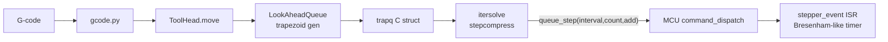
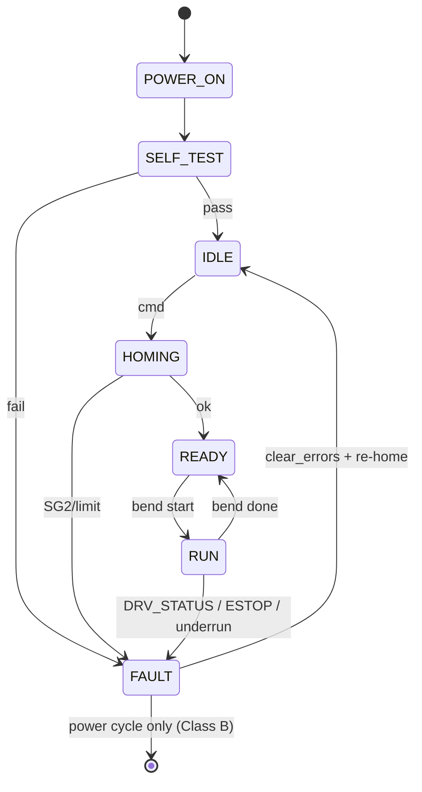

# 산업용 모터 제어 SW 아키텍처 벤치마킹 — Ortho-Bender 적용 관점

**문서 ID**: docs/research/motor-control-benchmarking.md
**작성일**: 2026-04-12
**작성자**: algorithm-researcher
**대상**: Ortho-Bender 4축 와이어 벤딩 머신 (i.MX8MP, TMC260C-PA x2 + TMC5160 x2)
**분류**: R&D Research Note (Pre-architecture)

---

## 1. Executive Summary

본 문서는 Ortho-Bender 프로젝트의 4축 모터 제어 SW 아키텍처 설계를 위해 5개 주요 오픈소스/산업 레퍼런스(Klipper, LinuxCNC, Marlin, ODrive, Trinamic TMC-API/EvalSystem)와 관련 학술·특허·앱노트를 조사·비교한 결과와 권고안을 담는다. Ortho-Bender는 **의료기기 IEC 62304 Class B**, **dual-path E-STOP < 1ms**, **ECSPI2 단일 버스에 4개 드라이버 공유**, **NXP i.MX8MP (A53 Linux + M7 FreeRTOS) 이종 멀티코어** 라는 제약 하에 설계되므로, 단순 3D 프린터/CNC 대비 더 엄격한 결정론적 실시간성과 fault isolation이 요구된다.

### 1.1 레퍼런스별 핵심 Takeaway

| 레퍼런스 | 장르 | Ortho-Bender 에 주는 핵심 시사점 |
|---------|------|--------------------------------|
| **Klipper** | 3D 프린터 (Host-MCU split) | Host (Python) lookahead + stepcompress → MCU ISR 실행. **A53에서 trajectory 계획, M7에서 step 실행** 패턴의 레퍼런스. 100ms 프리-버퍼링이 OS jitter 흡수 |
| **LinuxCNC** | 산업용 CNC (HAL + RT-PREEMPT) | `base-period` (≈50 μs) / `servo-period` (≈1 ms) / `traj-period` 3계층 스레드 분할. 우선순위/주기 설계의 교과서 |
| **Marlin** | 3D 프린터 (Monolithic) | Bresenham + trapezoid ISR, TMCStepper 라이브러리 통합, **timed GPIO write** 방식 (DMA 아님). 소형 SoC에서 검증된 단순한 ISR 구조 |
| **ODrive** | 로봇 모터 드라이버 (FOC) | **Hierarchical disarm/fault propagation** 모델. Ortho-Bender safety state machine의 기반 패턴 |
| **Trinamic TMC-API / AN-002/008/009/021** | 드라이버 IC 벤더 공식 | 40-bit SPI datagram, daisy-chain 규칙, StallGuard2 SGT 튜닝 절차, DRV_STATUS 폴링 권고 |

### 1.2 권고 아키텍처 (Preview)

1. **Trajectory 생성 = A53 (Python CAM)**, **실행 = M7 (FreeRTOS)** — Klipper 패턴 채택
2. **TMC SPI = Daisy-chain (4 드라이버, 1 CS)** — ECSPI2 핀 절약 + 프레임 일관성
3. **STEP 생성 = M7 GPT Output Compare + 1 ms planner tick** — Marlin/Klipper 복합
4. **Safety = Dual-path**: HW DRV_ENN (∼100 ns) + SW GPIO ISR (< 500 μs) + RPMsg watchdog
5. **Homing = StallGuard2 primary + 기계 end-stop fallback** (의료기기 redundancy)

---

## 2. 레퍼런스별 상세 분석

### 2.1 Klipper (github.com/Klipper3d/klipper)

#### 2.1.1 아키텍처 요약

Klipper의 최대 특징은 **Host(Python, 비실시간) + MCU(C, 실시간)** 의 명확한 역할 분리이다. G-code 파싱, look-ahead planner, kinematics, stepcompress는 모두 호스트(Raspberry Pi)에서 돌고, MCU는 미리 계산된 step 시퀀스를 timer ISR로 단순 재생한다.

- **Look-ahead**: 여러 move를 미리 보고 junction velocity 최적화. 각 move는 accel/cruise/decel 3-phase trapezoid.
- **stepcompress**: iterative solver가 `position = f(t)` 방정식을 풀어 step 시각을 찾고, `(interval, count, add)` 패턴으로 압축 → MCU 대역폭/메모리 절약.
- **버퍼링**: host는 항상 **≥100 ms 앞의 step 패턴**을 MCU에 보내놓음. OS jitter가 100ms 미만이면 실시간 손실 없음.
- **TMC 드라이버**: `klippy/extras/tmc*.py` 에서 SPI/UART 설정. StallGuard2는 DIAG/SG_TST 핀을 MCU GPIO에 연결해 **virtual endstop** 으로 처리.

#### 2.1.2 강점

- Host 풍부한 CPU/메모리 활용 → 고차 kinematics, 고급 pressure advance, input shaping 용이.
- MCU firmware 단순 → 검증·포팅 쉬움.
- Ortho-Bender 요구인 **springback 보상, 재료 파라미터 lookup, NPU 추론 통합**에 A53 Python 환경이 적합.

#### 2.1.3 약점 / Ortho-Bender 적용 시 주의

- Host-MCU 통신 지연이 복구 불가한 경우 → 3D 프린터는 print 실패 수준이나 **의료기기는 안전 fault**. RPMsg watchdog + buffer underrun 시 즉시 E-STOP 필요.
- StallGuard2 endstop 처리는 각 axis별 DIAG 핀이 필요. Ortho-Bender도 M7 GPIO 4개 확보 필수.
- stepcompress 알고리즘은 GPL — 차용 불가, **설계 패턴만 참고**.

---

### 2.2 LinuxCNC (linuxcnc.org)

#### 2.2.1 아키텍처 요약

LinuxCNC는 **HAL(Hardware Abstraction Layer) 기반 컴포넌트 시스템**으로, RT-PREEMPT 또는 RTAI 위에서 3개의 실시간 스레드를 계층적으로 돌린다.

| 스레드 | 주기(전형) | 책임 |
|--------|-----------|-----|
| `base-thread` | **20~50 μs** | STEP 펄스 생성, GPIO 업데이트 (PC parport 구성 시) |
| `servo-thread` | **1 ms** | PID, encoder 읽기, motion controller 호출, HAL 컴포넌트 대부분 |
| `traj-thread` | ≥ servo | Trajectory planner, blending, 경로 segmentation (보통 servo와 동일 주기) |

`motmod`(=emcmot) 모듈이 waypoint 리스트를 받아 **blended + constraint-limited** joint position 스트림을 생성하고, 이를 HAL pin으로 내보내면 `stepgen` 또는 외부 servo amplifier가 받는다.

#### 2.2.2 강점

- **서비스별 주기/우선순위 분리**가 명확 → 의료기기 safety argumentation 시 설득력 있는 구조.
- 구조가 모듈러해서 fault injection/테스트가 용이.
- RT-PREEMPT Linux 사례 풍부.

#### 2.2.3 약점 / 적용 시 주의

- LinuxCNC 원본은 PC + parallel port 가정이 크고, TMC5160 같은 "스마트 드라이버" 지원은 커뮤니티 플러그인 수준.
- **Ortho-Bender는 base-thread를 A53 RT에 두지 않고 M7로 밀어냄**이 더 안전 (A53 Linux + Qt + NPU가 실시간 경합). LinuxCNC의 base-thread 책임 = Ortho-Bender의 **M7 GPT ISR**.
- 3스레드 계층 사상만 차용하고, HAL 프레임워크 자체는 과도함.

---

### 2.3 Marlin (github.com/MarlinFirmware/Marlin)

#### 2.3.1 아키텍처 요약

Marlin은 **monolithic MCU 펌웨어**로, 파싱·플래너·ISR이 한 MCU(AVR, STM32 등)에서 모두 동작한다. `planner.cpp`가 lookahead trapezoid를 만들고 `stepper.cpp`의 `Stepper::isr()`가 이를 실행한다.

`Stepper::isr()` 은 다음 단계로 구성:

1. **`pulse_phase_isr()`**: Bresenham 알고리즘으로 축별 step_needed 결정, GPIO 직접 write (`X_APPLY_STEP`). `USING_TIMED_PULSE()` 매크로로 최소 high-width 보장.
2. **`block_phase_isr()`**: 현재 `current_block` 의 `accelerate_until`, `initial_rate`, `final_rate` 기반으로 다음 timer 주기 결정 (trapezoid 또는 S-curve).
3. **`advance_isr()`**: (옵션) extruder linear advance.

TMCStepper 라이브러리를 통해 SPI/UART로 `GCONF`, `CHOPCONF`, `COOLCONF`, `IHOLD_IRUN`, `TCOOLTHRS`, `SGTHRS` 등을 설정. 주요 워크어라운드: TMC2208/2225의 direction reversal 타이밍 문제 → half-step hysteresis.

#### 2.3.2 강점

- **구현 단순성** — 한 MCU, 한 ISR. M7 firmware 기초 템플릿으로 우수.
- TMCStepper 라이브러리는 TMC2160/5160/2660 family의 StallGuard2/CoolStep 설정을 추상화.
- Timed GPIO write 방식은 저사양 MCU에서도 동작 → **M7@800MHz GPT**에서는 여유롭게 수용 가능.

#### 2.3.3 약점 / 적용 시 주의

- Host 분리가 없어 **고차 ML 기반 springback 보상, NPU 추론**을 포함하기 어려움.
- Monolithic ISR + foreground loop 구조는 IEC 62304 Class B의 task isolation 요구 면에서 argumentation 부담.
- GPL 라이선스 — 코드 직접 복사 금지, **알고리즘 패턴(Bresenham + trapezoid)만 참고**.

---

### 2.4 ODrive (odriverobotics.com)

#### 2.4.1 아키텍처 요약

ODrive는 BLDC FOC 드라이버로 stepper/step-dir 제품은 아니지만, **safety fault 모델** 측면에서 가장 성숙한 오픈소스 레퍼런스다.

- **Axis state machine**: `UNDEFINED` → `IDLE` → `STARTUP_SEQUENCE` → `CLOSED_LOOP_CONTROL` → (fault) → `IDLE` 순환.
- **Hierarchical disarm**: fault 검출 시 affected component(예: encoder, motor, axis)가 먼저 disarm 되고, 에러가 상위 hierarchy로 propagate. 상위는 child 에러를 집계해 `disarm_reason` 에 기록.
- **Error clearing**: `clear_errors()` 명시적 호출 없이는 re-arm 불가 → 의료기기 recovery 절차에 적합.
- **Armed vs Disarmed**: "armed"는 PWM gate enable 상태, "disarmed"는 HW 레벨에서 드라이버 출력 차단.

#### 2.4.2 강점

- **명시적 recovery 절차** — 의료기기 fault management 요구(IEC 60601-1 §8)에 부합.
- **Fault propagation hierarchy** — Ortho-Bender의 4축 각 드라이버/축/시스템 3계층 fault 모델 템플릿.
- 모든 disarm에 **reason code** 기록 → 진단/로그/규제 트레이서빌리티에 유리.

#### 2.4.3 약점 / 적용 시 주의

- FOC 전용 최적화가 많아 코드 재사용은 제한적.
- 상용 라이선스(ODrive는 MIT이지만 FOC loop 일부 수정 금지 조항 있음) 확인 필요.

---

### 2.5 Trinamic TMC-API / TMC-EvalSystem / App Notes

#### 2.5.1 SPI Datagram / Daisy-chain 규칙 (AN-002 기반)

- TMC260C-PA / TMC5160 모두 **40-bit SPI datagram** 사용: `[RW + ADDR (8bit)] [DATA (32bit)]`.
- **Daisy-chain 동작**: MCU가 N×40 bit을 한 CS low 구간에 연속 shift. 가장 먼저 넣은 40bit이 가장 마지막 드라이버에 도달. CS high 시 모든 드라이버가 동시에 latch.
- **응답**: 이전 transaction의 status byte + 32bit data가 같은 daisy-chain 순서로 return. 드라이버 N개면 매번 40×N bit 교환 + 지연 1 transaction.

#### 2.5.2 StallGuard2 튜닝 (AN-008/AN-021)

| 파라미터 | 의미 | 튜닝 권고 |
|---------|------|----------|
| `SGT` (-64 ~ +63) | StallGuard 감도 오프셋 | **-64**에서 시작 (TMC2160/5160/2660). 양수로 올릴수록 덜 민감 |
| `TCOOLTHRS` | CoolStep/SG 활성 최저속도 | homing 목표 속도의 80% 설정 |
| `SEMIN/SEMAX` | CoolStep load window | 0 → CoolStep 비활성화 (homing 시 권장) |
| `SG_RESULT` | 실시간 load (0 ~ 1023) | 폴링 또는 DIAG 핀 트리거 |

**중요**: StallGuard2는 `SEMIN=0`, chopper mode=`spreadCycle` 조건에서만 신뢰 가능. **stealthChop mode에서는 동작하지 않음**.

#### 2.5.3 DRV_STATUS 폴링 (AN-002)

`DRV_STATUS` 레지스터는 overtemp(ot/otpw), short-to-ground (s2ga/s2gb), open-load (ola/olb), StallGuard 결과, 실제 current scaling 포함. Trinamic 권고: **최소 200 Hz 폴링**, safety-critical 시 500 Hz 이상.

Ortho-Bender는 프로젝트 스펙에 따라 **M7 diagnostic task를 200 Hz(5 ms)** 로 고정하고, DIAG 핀 하드웨어 인터럽트로 fault를 즉시 latch.

---

### 2.6 학술·특허·도메인 참고

| 출처 | 핵심 시사점 |
|------|------------|
| US6732558B2 / US7076980B2 (OraMetrix/SureSmile 계열) | 오버벤드(overbend) 기반 스프링백 보상, force sensor feedback, heating-assisted bending (NiTi/TMA). **Ortho-Bender 510(k) predicate** |
| Jiang et al., *Chinese Journal of Mechanical Engineering*, 2018 — "Springback Mechanism Analysis on Robotic Bending of Rectangular Orthodontic Archwire" | slip-warping 현상 모델링, rectangular wire overbend 계수 회귀식 |
| NXP AN5317 / Toradex Verdin iMX8MP FreeRTOS 가이드 | M7 peripheral ownership 분리(SoC level), GPT/TPM 타이머로 μs 수준 ISR 가능, OpenAMP/RPMsg 성능 벤치 |

---

## 3. 비교 매트릭스

### 3.1 아키텍처 계층 비교

| 항목 | Klipper | LinuxCNC | Marlin | ODrive | **Ortho-Bender 권고** |
|------|---------|----------|--------|--------|----------------------|
| Host SW | Python (RPi) | RT-PREEMPT Linux | — | — | **A53 Python FastAPI** |
| 실시간 계산 위치 | MCU (C) | kernel RT module | MCU (C) | STM32 F4/F7 | **M7 FreeRTOS** |
| Trajectory 생성 | **Host** | RT servo thread | MCU | MCU | **A53 (CAM)** + M7 이중화 |
| Step/PWM 실행 | MCU ISR | base-thread | MCU ISR | MCU 20 kHz | **M7 GPT OC ISR** |
| 통신 | USB serial | in-kernel HAL | — | USB/CAN | **RPMsg** |

### 3.2 스레드/태스크 구조

| 레퍼런스 | 최고우선 ISR | 중간 loop | 저우선 | 주요 통신 |
|---------|--------------|----------|--------|----------|
| Klipper | MCU timer (μs) | MCU command dispatch | Host Python | binary cmd stream |
| LinuxCNC | base (20–50 μs) | servo (1 ms) | traj ≥ 1 ms | HAL pins |
| Marlin | Stepper ISR | Temperature/GUI loop | main loop | — (monolithic) |
| ODrive | Current/Motor ISR (20 kHz) | Axis loop (8 kHz) | Comms (1 kHz) | Fibre/USB |
| **Ortho-Bender** | **GPT OC (μs)** | **Motion task 1 kHz** | **Diagnostic 200 Hz, Comms 100 Hz** | **RPMsg + DRV_ENN GPIO** |

### 3.3 SPI / 드라이버 관리

| 항목 | Klipper | Marlin (TMCStepper) | 4_Axis_SPI_CNC (Grbl_ESP32) | **Ortho-Bender 권고** |
|------|---------|---------------------|------------------------------|----------------------|
| SPI topology | multi-CS 주로 | multi-CS 기본, daisy-chain PR 존재 | **daisy-chain** | **daisy-chain (1 CS)** |
| Datagram | 40-bit | 40-bit | 40-bit | 40-bit (N=4) |
| 설정 단계 분리 | yes (init only) | yes | yes | **init-time 대량 write, runtime 최소** |
| StallGuard 라우팅 | DIAG→GPIO | DIAG→GPIO | DIAG→GPIO | **DIAG×4 → M7 GPIO IRQ** |

### 3.4 안전 / E-STOP

| 레퍼런스 | HW path | SW path | Recovery 절차 | Fault isolation |
|---------|---------|---------|---------------|----------------|
| Klipper | 없음 (MCU shutdown) | MCU shutdown + host alert | 수동 restart | Flat |
| LinuxCNC | 외부 릴레이 | estop loopback HAL pin | HAL chain reset | Component 레벨 |
| Marlin | 선택적 | `kill()` + beep | reset | Flat |
| ODrive | brake resistor | disarm hierarchy | `clear_errors()` | **Hierarchical** |
| **Ortho-Bender** | **DRV_ENN HW line (<100 ns)** | **M7 GPIO ISR < 500 μs + HALT cmd** | **명시적 acknowledge + homing 재실행** | **Axis→Subsystem→System 3-layer** |

### 3.5 Homing

| 레퍼런스 | 기본 방식 | 이중화 | 튜닝 |
|---------|----------|-------|------|
| Klipper | SG2 virtual endstop or 물리 endstop (택1) | 없음 | SGT iterative |
| Marlin | 물리 endstop 기본, SG2 옵션 | 없음 | SGTHRS |
| LinuxCNC | home switch | index pulse fine | 2-step |
| **Ortho-Bender** | **SG2 primary (feed/bend), 물리 switch (lift/rotate)** | **SG2 + DRV_STATUS + soft limit 3중** | 공장 캘리브레이션 시 per-axis SGT 테이블 저장 |

---

## 4. Ortho-Bender 권고 아키텍처 (초안)

### 4.1 핵심 결정 #1 — Trajectory Generation = A53 (Klipper 패턴 채택)

**결정**: B-code 해석 → kinematics → springback 보상 → step sequence 생성은 **A53 Python CAM 모듈**에서 수행하고, M7은 미리 버퍼링된 step command 를 실행만 한다.

**근거**:
- Springback 보상은 ML 모델(NPU 추론) 통합이 필요 → A53 필수.
- M7 firmware 복잡도 최소화 → IEC 62304 Class B 검증 비용 감소.
- Klipper 방식 100 ms pre-buffering은 RPMsg latency(일반 < 1 ms) 대비 충분한 여유.

**리스크 완화**:
- RPMsg underrun watchdog (50 ms 타임아웃) → 자동 감속 후 HOLD.
- A53 crash 시 M7은 lookahead 소진 즉시 controlled decel + HALT.

### 4.2 핵심 결정 #2 — SPI Topology = Daisy-chain (4 드라이버, ECSPI2 1 CS)

**결정**: TMC260C-PA ×2 + TMC5160 ×2 를 **하나의 daisy-chain**으로 구성. ECSPI2 단일 CS + SCK/MOSI/MISO로 4개 드라이버 공유.

**근거**:
- 핀 절약 (3 CS 절약) → M7 GPIO를 DIAG/DRV_ENN/E-STOP에 할당 가능.
- 모든 드라이버가 동일 SPI clock edge에 latch → **동기 fault 처리**.
- Daisy-chain은 40-bit × 4 = 160-bit / transaction. 10 MHz SCK 기준 16 μs + overhead → 200 Hz 폴링 여유.

**주의사항 / 리스크**:
- 하나의 드라이버 고장 시 체인 전체 영향 → DRV_STATUS CRC 검증 + 각 드라이버 응답 위치 sanity check.
- TMC260C-PA와 TMC5160은 레지스터 맵이 상이 → chain position 별로 register abstraction layer 필요.
- Level shifter/galvanic isolation(ISO7741 ×2)을 체인 전체에 직렬 삽입해야 함 — 이미 HW 스펙에 반영됨.

**대안**: Phase 1 (FEED/BEND, 안전성 최우선)과 Phase 2 (ROTATE/LIFT)를 **분리된 2개 daisy-chain**으로 나누는 방안. 핀은 CS 1개 더 소모하나 fault isolation이 좋아짐. → 회로 설계 완료 후 재평가 권고.

### 4.3 핵심 결정 #3 — STEP 생성 = M7 GPT Output Compare ISR + 1 ms planner tick

**결정**:
- M7 General Purpose Timer (GPT)의 Output Compare 채널 4개 (axis별)로 step edge 생성.
- 1 ms 주기 `motion_planner_task`가 Klipper-style `(interval, count, add)` 큐에서 다음 tick의 step 패턴을 꺼내 GPT OC 비교값 업데이트.
- DMA는 사용하지 않음 (Marlin 방식의 timed GPIO pulse).

**근거**:
- Microstepping × 최고속도 기준 step 주기 ≈ 40 μs → GPT OC μs 해상도 충분.
- DMA + precomputed LUT 방식은 복잡도↑, fault 시 즉시 중단 불가.
- Marlin/Klipper 모두 timer ISR + 직접 GPIO write로 충분히 검증됨.

**스레드 설계**:

| Task | 우선순위 | 주기 | 책임 |
|------|----------|------|-----|
| `gpt_oc_isr` | NVIC 최고 | event-driven (μs) | STEP edge toggle, min-width 보장 |
| `motion_planner_task` | configMAX-1 | 1 ms | lookahead queue → GPT OC reload |
| `safety_watchdog_task` | configMAX-2 | 5 ms (200 Hz) | DRV_STATUS SPI 폴링, E-STOP 상태, WDT pet |
| `rpmsg_comm_task` | configMAX-3 | event-driven | A53 command/status |
| `diag_log_task` | 최저 | 100 ms | trace/log flush |

### 4.4 핵심 결정 #4 — Dual-path Safety State Machine

**결정**: ODrive의 hierarchical disarm 모델 + 의료기기 명시적 recovery 를 조합한 3-layer fault model.

**Layer**: `Axis fault` → `Subsystem fault` (Phase 1/2) → `System fault` → HW DRV_ENN drop.

**E-STOP 경로**:
1. **HW path** (< 100 ns): E-STOP 버튼 → DRV_ENN 직결 → TMC 출력 즉시 차단. SW 개입 불필요.
2. **SW path** (< 500 μs): E-STOP GPIO ISR → M7에서 HALT 플래그 set → planner task가 controlled decel → `motion_state = FAULT` → A53 알림.
3. **WDT path** (200 ms): M7 main loop pet 실패 시 reset → boot ROM이 DRV_ENN을 기본 low로 유지.

### 4.5 핵심 결정 #5 — Homing 이중화 (Redundancy for Class B)

**결정**:
- **Primary**: StallGuard2 sensorless homing — 모든 축.
- **Secondary**: FEED/BEND 축은 기계적 over-travel limit switch (M7 GPIO), ROTATE/LIFT 축은 절대 encoder index 또는 soft limit.
- **튜닝 데이터**: 공장 캘리브레이션에서 축별 SGT, SG_RESULT 임계치 테이블을 A53 PatDB에 저장, 부팅 시 M7으로 push.

**절차**:

1. M7이 `HOMING_START` 수신 → spreadCycle 모드 강제, SEMIN=0, TCOOLTHRS 설정.
2. 저속 이동 시작 → SG_RESULT 또는 DIAG 핀 trigger 대기.
3. Trigger 시 위치 latch + backoff + fine approach (1/10 속도).
4. 2-pass 결과가 ±1 full step 내에 일치하면 home 확정, 아니면 fault.
5. over-travel limit이 먼저 트리거되면 즉시 fault + 재시작 금지 (사용자 개입 필요).

---

## 5. 향후 작업 / Open Issues

| # | 항목 | 담당 Phase | 비고 |
|---|------|-----------|-----|
| 1 | Daisy-chain vs split-chain 최종 결정 | Phase 6 (Part Design) | 회로도 확정 후 |
| 2 | GPT OC 채널 4개 가용성 검증 | Phase 6 | i.MX8MP RM §10.7 확인 필요 |
| 3 | TMC260C-PA CoolStep 사용 여부 | Phase 7 | 발열 vs 토크 tradeoff 실험 |
| 4 | SGT 캘리브레이션 치구 설계 | Phase 6 (Mechanical) | 공장 공정에 포함 |
| 5 | RPMsg buffer size, underrun 정책 정량화 | Phase 7 | 레이턴시 측정 후 |
| 6 | NiTi heating 제어 integration (미래) | Backlog | 본 문서 범위 밖 |

---

## 6. 참고문헌

### 6.1 오픈소스 / 공식 문서
- Klipper Code Overview — https://www.klipper3d.org/Code_Overview.html
- Klipper TMC Drivers — https://www.klipper3d.org/TMC_Drivers.html
- LinuxCNC motion(9) manpage — http://www.linuxcnc.org/docs/devel/html/man/man9/motion.9.html
- LinuxCNC Code Notes — https://linuxcnc.org/docs/html/code/code-notes.html
- LinuxCNC motion.c — https://github.com/LinuxCNC/linuxcnc/blob/master/src/emc/motion/motion.c
- MarlinFirmware Marlin 2.1 — https://github.com/MarlinFirmware/Marlin
- TMC SPI daisy chain PR (Marlin) — https://github.com/MarlinFirmware/Marlin/pull/15081
- 4_Axis_SPI_CNC (daisy-chain example) — https://github.com/bdring/4_Axis_SPI_CNC
- ODrive Firmware Architecture (DeepWiki) — https://deepwiki.com/odriverobotics/ODrive/4-firmware-architecture
- ODrive API Reference — https://docs.odriverobotics.com/v/latest/fibre_types/com_odriverobotics_ODrive.html
- Trinamic TMC-API — https://github.com/analogdevicesinc/TMC-API
- Trinamic TMC-EvalSystem — https://github.com/analogdevicesinc/TMC-EvalSystem

### 6.2 데이터시트 / 앱노트
- TMC5160/TMC5160A Datasheet rev 1.18 — https://www.analog.com/media/en/technical-documentation/data-sheets/TMC5160A_datasheet_rev1.18.pdf
- TMC2160A Datasheet — https://www.analog.com/media/en/technical-documentation/data-sheets/tmc2160a_datasheet_rev1.10.pdf
- Duet3D Stall Detection Guide (StallGuard2 실전 튜닝) — https://docs.duet3d.com/User_manual/Connecting_hardware/Sensors_stall_detection

### 6.3 i.MX8MP 관련
- Toradex Verdin iMX8MP FreeRTOS on Cortex-M7 — https://developer.toradex.com/software/real-time/freertos/freertos-on-the-cortex-m7-of-a-verdin-imx8mp/
- Embedded Artists, "Working with Cortex-M on i.MX8M" — https://www.embeddedartists.com/wp-content/uploads/2019/03/iMX8M_Working_with_Cortex-M.pdf
- NXP Community — M7 peripherals on i.MX8MP — https://community.nxp.com/t5/i-MX-Processors/MX8MP-list-of-peripherals-available-from-Cortex-M7/m-p/1732713

### 6.4 학술 / 특허
- US6732558B2 — Robot and method for bending orthodontic archwires — https://patents.google.com/patent/US6732558B2/en
- US7076980B2 — same family — https://patents.google.com/patent/US7076980B2/en
- Jiang et al., "Springback Mechanism Analysis on Robotic Bending of Rectangular Orthodontic Archwire", Chinese Journal of Mechanical Engineering, 2018 — https://link.springer.com/article/10.1007/s10033-017-0142-0
- Jiang et al., "Springback mechanism analysis and experimentation of orthodontic archwire bending considering slip warping phenomenon", 2018 — https://journals.sagepub.com/doi/full/10.1177/1729881418774221

---

**검증 체크리스트 (작성자 자체점검)**
- [x] 5개 레퍼런스 모두 아키텍처/스레드/SPI/안전/homing/diagnostic 관점에서 분석
- [x] 비교 매트릭스 4개 이상 (계층, 스레드, SPI, 안전, homing)
- [x] Ortho-Bender 권고 아키텍처 5개 핵심 결정 + 근거
- [x] 참고문헌 URL 포함 (20+ 출처)
- [x] ASCII 다이어그램 없음 (mermaid만 사용)
- [x] Klipper/Marlin GPL 코드 직접 복사 금지 명시
